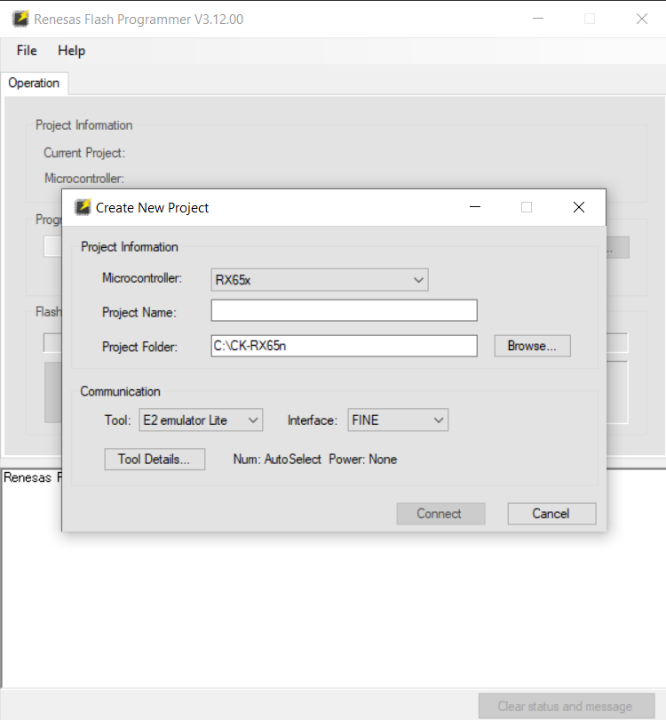
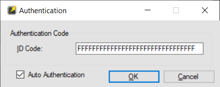
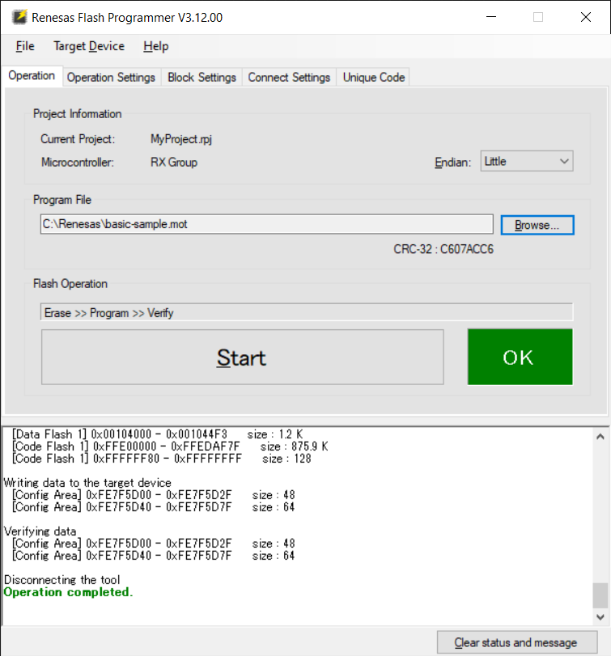

# Renesas CK-RX65N (blue PCB) Quick Start Guide

## 1. Prerequisites

* PC with Windows 10/11
* Internet connection for the PC
* Network cable for the Renesas board
* (2) USB-A to micro-USB cables <b>with data support</b>
* A serial terminal application such as [Tera Term](https://ttssh2.osdn.jp/index.html.en) or a browser-based application like [Google Chrome Labs Serial Terminal](https://googlechromelabs.github.io/serial-terminal/)

## 2. Download & Install Renesas Software

**Download** and **Install** the [Renesas Flash Programmer](https://www.renesas.com/eu/en/software-tool/renesas-flash-programmer-programming-gui)

## 3. Download Firmware

**Download** the QuickStart Firmware (MOT file):  [ck-rx65n-fw-20231026.mot](https://saleshosted.z13.web.core.windows.net/sdk/renesas/ck-rx65n-qs/ck-rx65n-fw-20231026.mot)

## 4. IoTConnect Account Setup

This guide requires an IoTConnect on Azure account.

>**NOTE:**
> If you have already created an IoTConnect on Azure account, or were provided an account as part of a training or workshop, skip this section.

If you need to create an account, a free 2-month subscription is available.
Please follow the 
[Creating a New IoTConnect Account](https://github.com/avnet-iotconnect/avnet-iotconnect.github.io/blob/main/documentation/iotconnect/subscription/subscription.md)
guide and ensure to select the Azure version during registration:


## 5. IoTConnect Device Template Setup

> **Note:**  
> If you are following this guide as part of a training or workshop, a template has already been created and this section may be skipped.

An IoTConnect *Device Template* with Symmetric Key authentication type will need to be imported.
* Download the premade [Device Template with Symmetric Key Auth](https://github.com/avnet-iotconnect/avnet-iotconnect.github.io/blob/main/documentation/iotc-azurertos-sdk/samples//ck-rx65n/templates/device/CK-RX65Nsk_template.JSON).
* Import the template into your IoTConnect instance. (A guide on [Importing a Device Template](https://github.com/avnet-iotconnect/avnet-iotconnect.github.io/blob/main/documentation/iotconnect/import_device_template.md) is available or for more information on [Template Management](https://docs.iotconnect.io/iotconnect/user-manuals/devices/template-management/), please see the [IoTConnect Documentation](https://iotconnect.io) website.)

## 6. IoTConnect Device Creation

* Create a new device in the IoTConnect portal. (Follow the [Create a New Device](https://github.com/avnet-iotconnect/avnet-iotconnect.github.io/blob/main/documentation/iotconnect/create_new_device.md) guide for a detailed walkthrough.)
* Enter a value for the <var>Unique ID</var> and make note of it for later
* Enter a descriptive <var>Display Name</var>
* Select the template from the dropdown box hat was just imported (or provided)
* Generate a Base64 Key
   * **Option 1:**  Use a website such as [this one](https://generate.plus/en/base64) and leave the *Byte Length* at `16`
   * **Option 2:**  Run the following command in a shell (e.g. Git for Windows Bash or Cygwin):
     ```
      dd if=/dev/urandom bs=16 count=1 status=none | base64
     ```
* Copy the generated key (including any trailing "=") and paste in both <var>Primary Key</var> and <var>Secondary Key</var> fields
* Save this key as it will be used to setup the the device later on this guide

> **Note:**  
> It is not possible to reveal the key once added to the IoTConnect dashboard so be sure to save it.
 
* Click **Save**

## 7. Setup the CK-RX65N board

Esnure all cables (USB, Network) are removed from from the board.

<details><summary>Ensure the RUN/DEBUG jumper is set to <b>DEBUG</b></summary>

</details>

<details><summary>Connect the network and USB cables to the board</summary>

</details>

<details><summary>Verify the power LED (white hyphen between the "CK" and "RX65N") is illuminated</summary>

</details>

## 8. Flash the Board

* Launch the Renesas Flash Programmer tool
* Click **File** then **New Project...** and configure as below:
  * Change *Environment* to `RX65x`
  * Enter a *Project Name* of your choice
  * Select a *Project Folder* of your choice
  * Change *Tool* to `E2 emulator Lite`
  * Change *Interface* to `Fine`



 * Click **Connect**

<details><summary><b>Click</b> the <i>Auto Authentication</i> checkbox and <b>Click</b> OK</summary>

</details>

* **Click** *Browse* and select the MOT Firmware file previously downloaded
* **Click** *Start*

> **Note:**
> The board may fail on the first flash attempt. If so, just press **Start** again.

<details><summary>After a short time, ensure the "Operation completed." message is displayed.</summary>

</details>

<details><summary>The board is now programmed. You can now disconnect the USB cables and change jumper to <b>RUN</b>.</summary>

</details>


## 9. Setup the Serial Terminal

* Open the Serial Terminal application and setup as following to allow for logging:
  * Port: (Select the COM port with the device)
  * Speed: `115200`
  * Data: `8 bits`
  * Parity: `none`
  * Stop Bits: `1`
  * Flow Control: `none` 
* Reconnect the USB cables to power on the board.

## 10. Configure IoTConnect Information

<details><summary>Acquire CPID and ENV parameters from the IoTConnect Key Vault</summary>

</details>

* Switch to the serial terminal and enter the following as prompted:  
  * <var>CPID</var> - The Company ID aquired from the Key Vault  
  * <var>ENV</var> - The Environment aquired from the Key Vault  
  * <var>DUID</var> - This is the <var>Unique ID</var> previously entered during device created in Step 6  
  * <var>SYMMETRIC_KEY</var> - This is the key that was previously generated during device created in Step 6  

<details><summary>Verify that the board connects:</summary>

</details>

## 11. Visualize the Data

The telemetry can be visualized by using the Dynamic Dashboard feature of IoTConnect.  A sample dashboard has been created to display some telemtery from the board and is avail for download [here](templates/dashboard/renesas_CK-RX65N_dashboard_export.json).  
Once downloaded, select "Create Dashboard" from the top of the IoTConnect portal and then choose the "Import Dashboard" option and select the *Template Name* and *Device Name* used previously in this guide.

## Tips / Troubleshooting

<details><summary>Print this Document</summary>
To print this document with all details expanded, right-click on this document and 
select "Inspect" or "Inspect Element".  This will open the browser's developer tools. 
Go to the Console tab and paste the following code:

  ```
    document.querySelectorAll('details').forEach(el => el.open = true);
  ```
Press Enter. This will expand all images on this page. After that, use the 
browser's print functionality to print the page.
</details>
