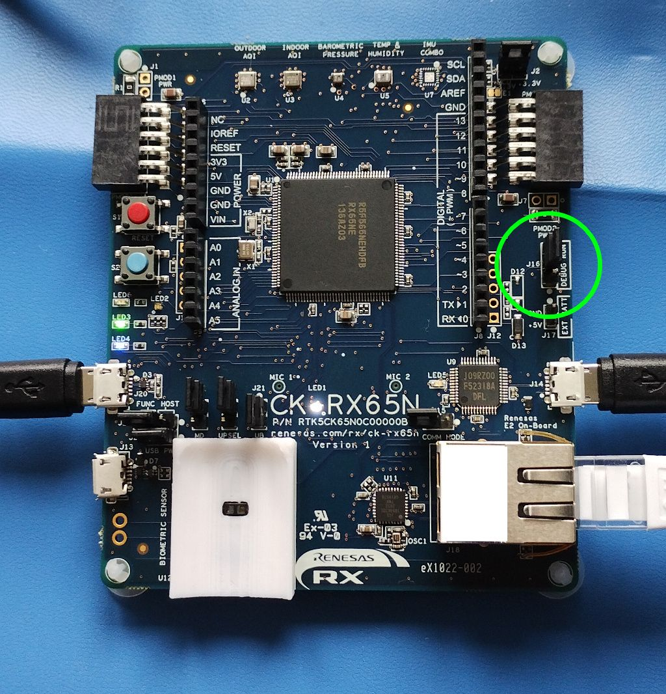

# Renesas CK-RX65N (blue PCB) Quick Start Guide

## 1. Prerequisites

* PC with Windows 10/11
* Internet connection for the PC
* Network cable for the Renesas board
* (2) USB-A to micro-USB cables <b>with data support</b>
* A serial terminal application such as [Tera Term](https://ttssh2.osdn.jp/index.html.en)

## 2. Download & Install Renesas Software

Follow the instructions to [setup the Renesas Envrionment](https://github.com/avnet-iotconnect/avnet-iotconnect.github.io/blob/main/documentation/iotc-azurertos-sdk/samples/ck-rx65n/environment_setup.md), then return to this guide.

## 3. Download Pre-Built Binary
Download the QuickStart ELF (Executable and Linking Format) file which contains the pre-built binary:  
[ck-rx65n-basic-sample-cli.elf](https://saleshosted.z13.web.core.windows.net/sdk/renesas/ck-rx65n-qs/ck-rx65n-basic-sample-cli.elf)

## 4. IoTConnect Account Setup

> **Note:**  
> If you have already created an IoTConnect Account, or were provided an account as part of a training or workshop, skip this section.

If you need to create an account, a free 2-month subscription is available.  Please follow the [Creating a New IoTConnect Account](https://github.com/avnet-iotconnect/avnet-iotconnect.github.io/blob/main/documentation/iotconnect/subscription/subscription.md) guide and return to this guide once complete.

## 5. IoTConnect Device Template Setup

> **Note:**  
> If you are following this guide as part of a training or workshop, a template has already been created and this section may be skipped.

An IoTConnect *Device Template* with Symmetric Key authentication type will need to be imported.
* Download the premade [Device Template with Symmetric Key Auth](https://github.com/avnet-iotconnect/avnet-iotconnect.github.io/blob/main/documentation/iotc-azurertos-sdk/samples//ck-rx65n/templates/device/CK-RX65Nsk_template.JSON).
* Import the template into your IoTConnect instance. (A guide on [Importing a Device Template](https://github.com/avnet-iotconnect/avnet-iotconnect.github.io/blob/main/documentation/iotconnect/import_device_template.md) is available or for more information on [Template Management](https://docs.iotconnect.io/iotconnect/user-manuals/devices/template-management/), please see the [IoTConnect Documentation](https://iotconnect.io) website.)

## 6. IoTConnect Device Creation

* Create a new device in the IoTConnect portal. (Follow the [Create a New Device](https://github.com/avnet-iotconnect/avnet-iotconnect.github.io/blob/main/documentation/iotconnect/create_new_device.md) guide for a detailed walkthrough.)
* Enter a value for the <var>Unique ID</var> and make note of it for later
* Enter a descriptive <var>Display Name</var>
* Select the template from the dropdown box hat was just imported (or provided)
* Generate a Base64 Key
   * <b>Option 1:</b>  Use a website such as [this one](https://generate.plus/en/base64) and leave the byte length at 16.
   * <b>Option 2:</b>  Run the following command in a shell (e.g. Git for Windows Bash or Cygwin):
     ```
      dd if=/dev/urandom bs=16 count=1 status=none | base64
     ```
* Copy the generated key (including any trailing "=") and paste in both <var>Primary Key</var> and <var>Secondary Key</var> fields
* Save this key as it will be used to setup the the device later on this guide

> **Note:**  
> It is not possible to reveal the key once added to the IoTConnect dashboard so be sure to save it.
 
* Click **Save**

## 7. Import the Project

Open e2 Studio
<details><summary>Click <b>File</b> then <b>Import...</b></summary>

</details>

<details><summary>Select the <b>C/C++ Executable</b> option</summary>

</details>

<details><summary>Click <b>Browse</b>, select the binary downloaded in Step 3, then click <b>Next</b></summary>

</details>

<details><summary>Click <b>Finish</b></summary>

</details>

<details><summary>Click <b>Close</b></summary>

</details>

## 8. Setup the CK-RX65N board

Esnure all cables (USB, Network) are removed from from the board.

<details><summary>Change Jumper to <b>DEBUG</b></summary>

</details>

<details><summary>Connect the network and USB cables to the board</summary>

</details>

<details><summary>Verify the power LED (white hyphen between the "CK" and "RX65N") is illuminated</summary>

</details>

## 9. Setup the Serial Terminal
Open serial console application, such as [Tera Term](https://ttssh2.osdn.jp/index.html.en), or a browser application like [Google Chrome Labs Serial Terminal](https://googlechromelabs.github.io/serial-terminal/), and configure as follows:
* Select the appropriate COM port
* 115200 baud rate
* 8-bit data
* No parity

## 10. Setup Debugging and Flash the Board

<details><summary>Right click on the project and select <b>Debug As -> Debug Configurations...</b></summary>

</details>

<details><summary>Double click on <b>Renesas GDB Hardware Debugging</b></summary>
  A new debug setup instance will apear directly beneath
</details>

<details><summary>Select the <b>Debugger</b> tab and verify settings as follows:</summary>

</details>  
 
 * <var>Debug hardware</var> is set to `E2 Lite (RX)`<br>
 * <var>Target Device</var> is set to `R5F565NE`

<details><summary>Just below, click the <b>Connection Settings</b> tab and ensure:</summary>

</details>  

* <var>Connection Type</var> is set to `Fine`
* Click <b>Apply</b> then <b>Debug</b> to begin flashing the board.

<details><summary>Verify the download begins in the console</summary>

</details>

<details><summary>Switch to the debug perspective when prompted.</summary>

</details>

The build contains <b>two</b> breakpoints that will be encountered after a short time.
<details><summary>Press the <b>Resume</b> button when the console indicates a breakpoint has been reached</summary>

</details>

> **Note:**  
> It may take a few minutes to move through the breakpoints depending on the speed of the PC.

Switch over to the serial terminal application and monitor the output.  

After a mintue or two, verify the following prompt is presented before moving on:<br>
`Type the CPID:`

<details><summary>The board is now programmed. You can now disconnect the USB cables, change jumper to <b>RUN</b>, and reconnect the USB cables</summary>

</details>

## 11. Configure IoTConnect Information

<details><summary>Acquire CPID and ENV parameters from the IoTConnect Key Vault</summary>

</details>

Enter the following into the Serial Terminal as prompted:  
  <var>CPID</var> - The Company ID aquired from the Key Vault  
  <var>ENV</var> - The Environment aquired from the Key Vault  
  <var>DUID</var> - This is the <var>Unique ID</var> previously entered during device created in Step 6  
  <var>SYMMETRIC_KEY</var> - This is the key that was previously generated during device created in Step 6  

<details><summary>Verify that the board connects:</summary>

</details>

## 12. Visualize the Data

A sample Dashboard will be available in the future.

## 13. Tips / Troubleshooting

<details><summary>Change perspectives in e<sup>2</sup> Studio</summary>
To return to C/C++ development view, select "Window", then "Perspective", then
"Open perspective", then "C/C++ project".

To return to debugging/running, select the "Window", then "Perspective", then
"Open perspective", then "Debug".
</details>
