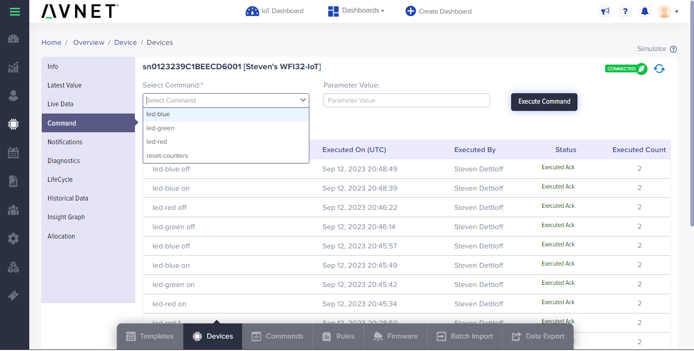

## 1. Introduction

This document provides instructions on how to quickly connect [WFI32-IoT](https://www.microchip.com/en-us/development-tool/ev36w50a) development board to Avnet's [IoTConnect](https://www.avnet.com/wps/portal/us/solutions/iot/iotconnect) platform without the need to compile any code from source. The guide further leverages [MicroE](https://www.mikroe.com/) click boards featuring [TE Connectivity](https://www.te.com/en/products/sensors.html) sensors.
* This QuickStart leverages the built-in ATECC608 secure element to enable a secure connection to IoTConnect.
* The Temperature and Light Sensor telemetry are supported.
* IoTConnect display user input from the on-board switches (SW1 & SW2).
* Althought not required, further telemetry can be visualized by adding Click boards (see below).

The Click board interface makes it possible to make use of hundreds of different Click boards from MikroE.
The following boards are directly supported and send sensor readings directly to IoTConnect:  
* [VAV Press Click](https://www.mikroe.com/vav-press-click)
* [Ultra-Low Press Click](https://www.mikroe.com/ultra-low-press-click)
* [PHT Click](https://www.mikroe.com/pht-click)
* [TEMP&HUM 14 click](https://www.mikroe.com/temphum-14-click)
* [Telaire T6713 CO2 Sensor Module](https://www.amphenol-sensors.com/en/telaire/co2/525-co2-sensor-modules/3399-t6713) on the [PROTO Click](https://www.mikroe.com/proto-click)
* [Telaire T9602 IP67 Harsh Environment Humidity & Temperature Sensor](https://www.amphenol-sensors.com/en/telaire/humidity/527-humidity-sensors/3224-t9602) on the [Terminal 2 Click](https://www.mikroe.com/terminal-2-click)
* [Air Quality 7 click](https://www.mikroe.com/air-quality-7-click)
* [Altitude 4 Click](https://www.mikroe.com/altitude-4-click)
* [Altitude 2 Click](https://www.mikroe.com/altitude-2-click)

## 2. Hardware Setup

### Setup Clicks  
**NOTE: The Click hardware is not required to complete this guide so if none are present, this section can be skipped.**
* Plug the VAV Press Click or Ultra-Low Press Click board onto Click interface of the board.
* To have both Click boards connected at the same time to WFI32-IoT, you can connect them via the
[Shuttle Click](https://www.mikroe.com/shuttle-click) adapter.
* When connecting Click boards, ensure that the pin markings on the Click boards are matching to the header markings on the WFI32-IoT.

### Setup WFI32-IoT Board  
* The WFI32-IoT board needs to be connected to a USB port on your PC via the Micro USB cable.
* Once the board boots up, a new USB devices will be available. 
  * Optionally, connect a terminal program (like TeraTerm) to one of the two COM ports
which is named "USB Serial". Use defaults for 115200 baud: 8 bits, 1 stop bit, no flow control or parity. 
Firmware logs will be available on that COM port. 
  * The MSD should appear as a new removable drive some time after the board boots up.

# 3. Programming the Firmware

* Download and install **v6.05** of the [MPLAB X IDE package](https://www.microchip.com/en-us/tools-resources/archives/mplab-ecosystem) (The newer versions of the included IPE have an issue connecting to the WFI32 board). 
MPLAB IPE and 32-bit device support are the only required options during the installation.
* Download the firmware [binary package](https://saleshosted.z13.web.core.windows.net/sdk/AzureRTOS/iotconnect-demo-wfi32-042423.zip).
* Extract the iotconnect-demo.X.production.hex file from the zip.
* Open the Microchip IPE application to program the firmware: 
  * In the **Device** entry box, select "WFI32E01"
  * In the **Tool** entry box, select "Curiosity/Starter Kits (PKBO4)"
  * Click the **Connect** button
  * Wait for any updates to complete and ignore any DFP related warnings in the output.
  * After the device is connected, updated, and verified (as reported in the output), click the **Browse** button next to the **Hex file** field and select the iotconnect-demo.X.production.hex file that was extracted previously.
  * Click the **Program** button.
  * The screenshot below shows an example of what the IPE displays if the device has been programmed successfully:


# 4. IoTConnect Account Setup
This guide requires an IoTConnect account on Azure.

>**NOTE:**  
> If you have already created an IoTConnect account on Azure, or were provided an account as part of a training or workshop, skip this section.

If you need to create an account, a free 2-month subscription is available.
Please follow the 
[Creating a New IoTConnect Account](https://github.com/avnet-iotconnect/avnet-iotconnect.github.io/blob/main/documentation/iotconnect/subscription/subscription.md)
guide and ensure to select the [Azure version](https://subscription.iotconnect.io/subscribe?cloud=azure) during registration:


# 5. IoTConnect Device Template Setup
**NOTE: If you are following this guide as part of a training or workshop, a template may already be created for this device (typically "wfi32demo_r2") and you my skip this section.**

A Device Template with Self Signed authentication type will need to be imported.
* Download the premade [Device Template with Self-Signed Auth](https://github.com/avnet-iotconnect/avnet-iotconnect.github.io/blob/main/documentation/iotc-azurertos-sdk/samples/wfi32iot/templates/device/wfi32demo_r2_template.JSON).
* Import the template into your IoTConnect instance. (A guide on [Importing a Device Template](https://github.com/avnet-iotconnect/avnet-iotconnect.github.io/blob/main/documentation/iotconnect/import_device_template.md) is available or for more information on [Template Management](https://docs.iotconnect.io/iotconnect/user-manuals/devices/template-management/), please see the [IoTConnect Documentation](https://iotconnect.io) website.)

# 6. Obtaining the Device Certificate Fingerprint
This section outlines how to set up the device for IoTConnect Self Signed Certificate authentication type.
Other authentication types can be used, but are out of scope for this guide.

* In order to complete the next steps a fingerprint of the device certificate will need to be created.
The device certificate is located in the file named snXXXXXX_device.pem on the Mass Storage Device.
The fingerprint of the certificate can be generated as either SHA256 or SHA1 (default).
There are a couple of ways to create the fingerprint:
   * (Online Tool) The contents of snxXXXX_device.pem can be pasted into an [online fingerprint calculator](https://www.samltool.com/fingerprint.php).
   * (Local with OpenSSL) Execute ``` openssl x509 -noout -fingerprint -inform pem -in snxXXXX_device.pem ```

Below is a sample screenshot from the online tool:


# 7. IoTConnect Device Setup
* Create a new device in the IoTConnect portal. (Follow the [Create a New Device](https://github.com/avnet-iotconnect/avnet-iotconnect.github.io/blob/main/documentation/iotconnect/create_new_device.md) guide for a detailed walkthrough.)
* Enter a the "snXXXXXXXX" (do not include the "__device.pem") from earlier in the *Unique ID* field and enter a descriptive *Display Name* of your choice.
* Select the template from the dropdown box that was just imported (or provided to you).
* Enter the fingerprint calculated previously into the **Thumbprint** field.
* Click Save and press the Reset button on the board.

# 8. Configuration
To configure the WiFi Credentials and IoTConnect Account environment information, two files on the USB Mass Storage Device need to be editited.

## Configure the WiFi Credentials
* The WiFi Credentials are configred in the WIFI.CFG file located on the MSD. Open the file in a text editor and input the WiFi credentials using one of the
following templates per the network configuration:
   - Open Unsecured Network (no password protection)
        ```bash
        CMD:SEND_UART=wifi MY_SSID,,1
        ```
    - Wi-Fi Protected Access 2 (WPA2) [Most Common]
        ```bash
        CMD:SEND_UART=wifi MY_SSID,MY_PSWD,2
        ```
    - Wired Equivalent Privacy (WEP)
        ```bash
        CMD:SEND_UART=wifi MY_SSID,MY_PSWD,3
        ```
    - Wi-Fi Protected Access 3 (WPA3)
        ```bash
        CMD:SEND_UART=wifi MY_SSID,MY_PSWD,4
        ```
* Save the file when done.

## Configure the IoTConnect Account
* Open the CLOUD.CFG file in a text editor. If the contents of CLOUD.CFG do not have text like CPID and ENV, 
delete the file, eject the drive, reset the board and re-open the file as resetting will populate the defaults.
* Set the CPID and Environment per your IoTConnect account settings, which can be found in Settings -> Key Vault in the IoTConnect portal.
* The DUID and SYMMETERIC_KEY can be let empty.
* Save the file, eject the USB drive and reset the board.
* The device should connect to the specified IoTConnect account and publish sensor data periodically.

# 9. Visualization
The telemetry can be visualized by using the Dynamic Dashboard feature of IoTConnect. A sample dashboard that is preconfigured to display some telemtery from the board is available for download [here](https://github.com/avnet-iotconnect/avnet-iotconnect.github.io/blob/main/documentation/iotc-azurertos-sdk/samples/wfi32iot/templates/dashboards/wfi32iot_quickstart_dashboard_export.json). Once downloaded, select "Create Dashboard" from the top of the IoTConnect portal and then choose the "Import Dashboard" option and select the template and device name used previously in this guide.

# 10. Sending Commands
* The board has 3 LEDs that can be toggled on and off by using the "on" or "off" parameter in conjunction with one of the LED commands.
* The board also has two buttons (across from the RST button) which increment a counter when pressed.  The counters can be reset by using the "reset-counters" command with a parameter of "1".

