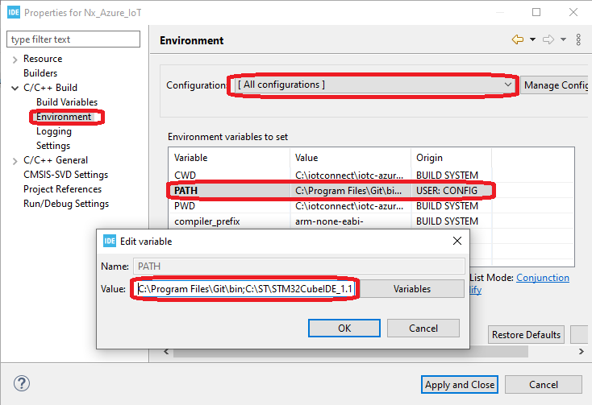

## Introduction

This document aims to provide a step-by-step-guide way to develop firmware for the
[STM32H573I-DK Discovery Kit](https://www.st.com/en/evaluation-tools/stm32h573i-dk.html) 
board with IoTConnect.

### Software Setup

The project development is currently supported on Windows and Linux and was tested with the following dependency versions:
* 
* Python 3.10 (On Linux, Windows does not require Python)
* STM32CubeIDE v1.14.0
* STM32CubeProgrammer v2.14.0
* Using ubuntu version earlier than 22.xx is not recommended.
It is possible to use Ubuntu 20.04, but installing python 3.10 as default (see later steps)
on Ubuntu 20.04 breaks the terminal application that comes with Ubuntu.

* If on Windows, you will need to install the Bash Shell and it **needs to be in your system path**.
Download and install either [Git Bash](https://git-scm.com/downloads) (Select default options during installation) 
or [MSYS2](https://www.msys2.org/). Note that WSL may not work as expected.
* You need to use git command line or a different tool that can clone Git repositories with submodule support.

### Project Setup

* Clone the iotc-azurertos-stm32-h5 repo (https://github.com/avnet-iotconnect/iotc-azurertos-stm32-h5)
into a directory. On Windows, preferably at the root of C: or another drive.
Windows has a path name limit of 256 characters which can cause the build to fail,
as some of the source files are deeply nested into directories.
* Download the [X-CUBE-AZURE Expansion Package](https://www.st.com/en/embedded-software/x-cube-azure-h5.html) version 1.0.0, 
and place the zip into the root directory of this cloned repository.
* Download the Secure Manager Package [X-CUBE-SEC-M-H5](https://www.st.com/en/embedded-software/stm32trustee-sm.html), 
and place the zip into the root directory of this cloned repository. 
The web site will require an approval before the package can actually be downloaded.
The approval usually takes a couple of hours, but may take up to 48 hours.
* When done, there should be two zip files in the root of this repo:
  * en.x-cube-azure-h5-v1-0-0.zip 
  * en.x-cube-sec-m-h5-1.0.0.zip
* In a bash shell (Git Bash on Windows), execute setup-project.sh. For example, if this repo is cloned into
C:\iotc-azuretos-stm32-h5:

```shell
cd /c/iotc-azuretos-stm32-h5
IoTConnect/scripts/setup-project.sh 
```

### Hardware Setup


1. Check that the SW1 switch near the Ethernet port is set to the “FLASH” (0) position.
2. Connect a USB C to USB A cable between the USB_STLINK connector (CN10) and your computer.
3. Connect the ethernet cable to your router.

### Project Build

* Once the project setup is completed, follow the original project X-CUBE-AZURE instructions at
*Projects/STM32H573I-DK/Applications/ROT/Nx_Azure_IoT/Getting_Started_STM32CubeIDE.html* 
with the following exceptions:
* On Windows, you do not need to install Python.
* You should skip the section Step 2 "**Install Required Software: Install Secure Manager package**", as we have done this step previously.
* You do not need to configure any files for IoTHub or IoTCentral outlined in Step #7 "**Application Configuration**".
* Step 8 "**Debugging**" is referring to the debug configurations which are not shipped with the original project package.
This project repo provides *Nx_Azure_IoT Debug.launch* that you can use to attach to running firmware and debug it.
* (Optional) Step 2 "**Install Required Software: Add bash.exe to your Path:**, instead of altering your system
by modifying the PATH variable we recommend that you instead to modify it for this project only, 
in IDE Project Settings like in this screenshot:



### Cloud Account Setup

**NOTE: If you have already created an IoTConnect Account, or were provided an account as part of a training or workshop, skip this section.**

If you need to create an account, a free 2-month subscription is available.
Please follow the 
[Creating a New IoTConnect Account](https://github.com/avnet-iotconnect/avnet-iotconnect.github.io/blob/main/documentation/iotconnect/subscription/subscription.md)
guide and return to this guide once complete.

### Device Setup

* A serial console application, such as [Tera Term](https://ttssh2.osdn.jp/index.html.en),
 or a browser application like [Google Chrome Labs Serial Terminal](https://googlechromelabs.github.io/serial-terminal/)
 is required for the next steps. 
 Configure settings per the screenshot below:


Follow the [Device Configuration section of the QuickStart Guide](QUICKSTART.md#device-configuration)

### IoTConnect Template Setup with Pre-made import
A Device Template with Self Signed authentication type will need to be imported.
* Download the premade [Device Template with Self-Signed Auth](templates/device/stm32h5-self-signed-template.json).
* Import the template into your IoTConnect instance. (A guide on [Importing a Device Template](https://github.com/avnet-iotconnect/avnet-iotconnect.github.io/blob/main/documentation/iotconnect/import_device_template.md) is available or for more information on [Template Management](https://docs.iotconnect.io/iotconnect/user-manuals/devices/template-management/), please see the [IoTConnect Documentation](https://iotconnect.io) website.)

### Troubleshooting
* Not connecting and no data is sent:  Verify CPID and  Environment.
* Output stopping with "No Device Found":  Ensure a new device was created in the portal and that the DUID matches the Device ID
