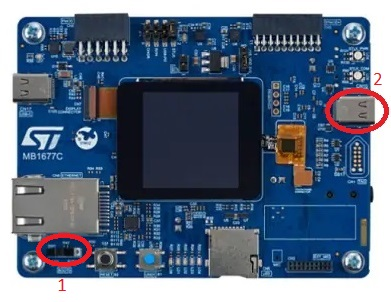
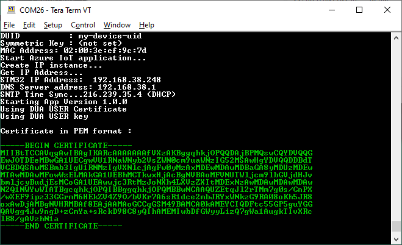

# 1. Introduction

This document provides a step-by-step-guide to program and evaluate the
[STM32H573I-DK Discovery Kit](https://www.st.com/en/evaluation-tools/stm32h573i-dk.html)
board with STM32Trust TEE Secure Manager (STM32TRUSTEE-SM) support on IoTConnect.

Though development is supported on both Linux and Windows, this quickstart guide currently only supports Windows 64-bit.

# 2. Required Software

* Download and install [Git Bash](https://git-scm.com/downloads) (Select default options during installation)
* Install [STM32CubeIDE](https://www.st.com/en/development-tools/stm32cubeide.html) v1.14.0 or greater. 
Note that some 1.13.x versions may give benign linker errors. 
* Install [STM32CubeProgrammer](https://www.st.com/en/development-tools/stm32cubeprog.html) v2.14.0 or greater.
Some older versions do not support the H5 Secure Manager.
* A serial console application, such as [Tera Term](https://ttssh2.osdn.jp/index.html.en), 
 or a browser application like [Google Chrome Labs Serial Terminal](https://googlechromelabs.github.io/serial-terminal/) configured per the screenshot below:  

# 3. Cloud Account Setup

**NOTE: If you have already created an IoTConnect Account, or were provided an account as part of a training or workshop, skip this section.**

If you need to create an account, a free 2-month subscription is available.
Please follow the 
[Creating a New IoTConnect Account](https://github.com/avnet-iotconnect/avnet-iotconnect.github.io/blob/main/documentation/iotconnect/subscription/subscription.md)
guide and return to this guide once complete.

### Hardware Setup

1. Check that the SW1 switch near the Ethernet port is set to the “FLASH” (0) position.
2. Connect a USB C to USB A cable between the USB_STLINK connector (CN10) and your computer.
3. Connect the ethernet cable to your router.

# 4. Firmware Setup

* Contact tour Sales Representative to obtain the binary package for this evaluation.
* Extract the package in a location that meets the following requirements to ensure compatibility with Windows:
  * The location path should be short, preferably the zip file should be extracted at the root of a drive (for example C:\stm32h5-demo) in order to ensure that path limit of 256 characters does not cause issues.
  * File path should not contain any spaces.
  * File path should only contain alphanumeric characters and hyphens.
  * File path should not be part of a synchronized location (e.g., OneDrive)
* Connect a USB cable to the Micro USB slot of the board.
* Execute (double-click in file explorer) the *provisioning.sh* script included in the package which is required to run the next step.
Running this script will provision the board with Secure Manager. This only needs to be run once per board.
After executing this step, the board will no longer be able
to run non-secure projects (see below).
* If you encounter issues the first time with *provisioning.sh* or *download.sh*, run *regression.sh* and then *provisioning.sh* again and/or *download.sh* after *provisioning.sh*.
* Execute the *download.sh* script included in the package to download the IoTConnect demo firmware.
You can ignore the running process warning when closing the window.
* *NOTE:* After completion of your evaluation, the *regression.sh* script can be run to once again allow standard (non-secure) project applications to be executed. Do not run this now.

# 5. Device Configuration

* Ensure the serial terminal application is running.
* Press the black RESET button on the board and look for the "X-CUBE-AZURE" title block in the console.

> **Note:**  
> The next steps involve entering text into the terminal that is NOT echoed as typed.  Enter the values and hit `Enter` and the input will be displayed for confirmation.

* In your terminal application enter "y" when prompted to set device configuration. You will only need to set values 1-3.
  * Set the values for your CPID and Environment by pressing '1', '2' and '3' respectively. 
CPID and Environment and Environment values can be located in the IoTConnect WebUI on the *Key Vault* page. 
Navigate there using the image below:

  * The DUID value should be set to the device name of your choosing, for example "stm32h5-01".
  * The Symmetric key should be left unset. This will allow for authentication using Secure Manager with certificate (x509) based authentication
  * Press '0' to write the configuration. This option will also reset the board.
  * After configuring the device settings, monitor the serial terminal for information similar to the screenshot below. You may have to scroll up in the terminal.

 

* A certificate fingerprint needs to be generated from the certificate.
  * Copy the Device Certificate from the console, including the BEGIN and END lines.
  * Paste the contents into the X509 Cert field at [this web site](https://www.samltool.com/fingerprint.php). (Optionally you can use openssl to print the device fingerprint, but this is outside the scope of this guide.)
  * Leave the "Algorithm" selection at the default SHA1, press "Calculate Fingerprint" and copy/save the Fingerprint field for later use.

# 6. IoTConnect Device Template Setup

A Device Template with Self Signed authentication type will need to be imported or created.
* Download the premade [Device Template with Self-Signed Auth](templates/device/stm32h5-self-signed-template.json).
* Import the template into your IoTConnect instance. (A guide on [Importing a Device Template](https://github.com/avnet-iotconnect/avnet-iotconnect.github.io/blob/main/documentation/iotconnect/import_device_template.md) is available or for more information on [Template Management](https://docs.iotconnect.io/iotconnect/user-manuals/devices/template-management/), please see the [IoTConnect Documentation](https://iotconnect.io) website.)

# 7. IoTConnect Device Setup

* Create a new device in the IoTConnect portal. (Follow the [Create a New Device](https://github.com/avnet-iotconnect/avnet-iotconnect.github.io/blob/main/documentation/iotconnect/create_new_device.md) guide for a detailed walkthrough.)
* Enter the DUID that wss chosen earlier into the *Unique ID* field and enter a descriptive *Display Name* of your choice.
* Select the template from the dropdown box that was just imported.
* Enter the Fingerprint calculated in the "Device Configuration" step into the Thumbprint field.
* Click Save and press the Reset button.

# 8. Verification

After the board is reset, it should be connecting and sending telemetry to the IoTConnect portal. We can verify by checking the "Live Data" feed.
* Return to the *Devices* page and click on the newly created Device ID.
* On the left sub-menu, click "Live Data" and after a few seconds, data should be shown. See below:

# 9. Troubleshooting

Using the serial terminal is the best way to identify issues. Common issues can be resolved by verifying the following items:
* Output stopping with a message about "IP Address":  Ensure that the ethernet cable is connected properly.
* Output stopping with "No Device Found":  Ensure a new device was created in the portal and that the DUID matches the Device ID
