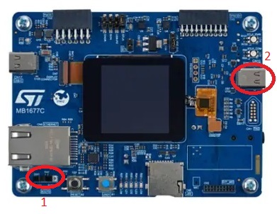
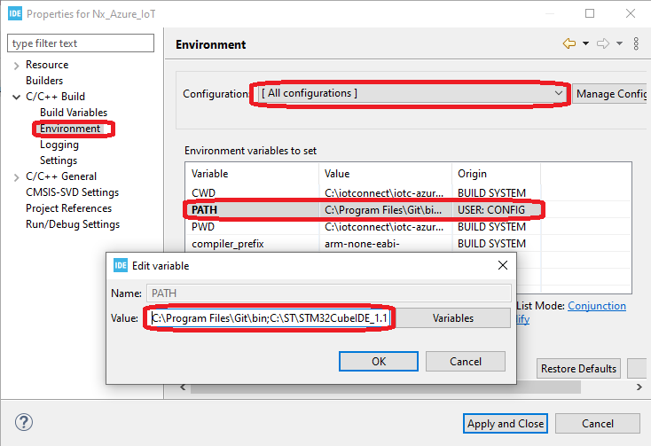

## Introduction

This document aims to provide a step-by-step-guide way to develop firmware for the
[STM32H573I-DK Discovery Kit](https://www.st.com/en/evaluation-tools/stm32h573i-dk.html) 
board with IoTConnect.

### Software Setup

The project development is currently supported on Windows and Linux and was tested with the following dependency versions:
* 
* Python 3.10 (On Linux, Windows does not require Python)
* STM32CubeIDE v1.14.0
* STM32CubeProgrammer v2.14.0
* Using ubuntu version earlier than 22.xx is not recommended.
It is possible to use Ubuntu 20.04, but installing python 3.10 as default (see later steps)
on Ubuntu 20.04 breaks the terminal application that comes with Ubuntu.

* If on Windows, you will need to install the Bash Shell and it **needs to be in your system path**.
Download and install either [Git Bash](https://git-scm.com/downloads) (Select default options during installation) 
or [MSYS2](https://www.msys2.org/). Note that WSL may not work as expected.
* You need to use git command line or a different tool that can clone Git repositories with submodule support.

### Project Setup

* Clone the iotc-freertos-stm32-h5 repo (https://github.com/avnet-iotconnect/iotc-freertos-stm32-h5)
into a directory. On Windows, preferably at the root of C: or another drive.
Windows has a path name limit of 256 characters which can cause the build to fail,
as some of the source files are deeply nested into directories.
* Download the [X-CUBE-AWS-H5 Expansion Package](https://www.st.com/en/embedded-software/x-cube-aws-h5.html) version 1.0.0, 
and place the zip into the directory above this cloned repository.
* Download the Secure Manager Package [X-CUBE-SEC-M-H5](https://www.st.com/en/embedded-software/stm32trustee-sm.html), 
and place the zip into the directory above of this cloned repository. 
The web site will require an approval before the package can actually be downloaded.
The approval usually takes a couple of hours, but may take up to 48 hours.
* When done, the directory structure should look like:
  * iotc-freertos-stm32-h5
  * en.x-cube-aws-h5-v1-0-0.zip
  * en.x-cube-sec-m-h5-v1-1-1.zip
* In a bash shell (Git Bash on Windows), execute setup-project.sh. For example, if this repo is cloned into
C:\iotc-freertos-stm32-h5:

```shell
cd /c/iotc-freertos-stm32-h5
IoTConnect/scripts/setup-project.sh 
```
* Afterwards execute rtospull.sh, answer "y" to FreeRTOSPlus & coreHTTP when asked. Assuming the same working directory as before:

```shell
IoTConnect/iotc-freertos-sdk/rtosPull.sh 
```


### Hardware Setup



1. Check that the SW1 switch near the Ethernet port is set to the “FLASH” (0) position.
2. Connect a USB C to USB A cable between the USB_STLINK connector (CN10) and your computer.
3. Connect the ethernet cable to your router.

### Project Build

* Open STMCube IDE
* Set the workspace to the iotc-freertos-stm32-h5 directory.
* Select "Import existing projects from workspace"
* Set the directory to the iotc-freertos-stm32-h5 directory.
* Check the selection boxes of "STM32H573I-DK_aws_eth" & "STM32H573I-DK_aws_eth_tz".
* (Optional) "**Install Required Software: Add bash.exe to your Path:**, instead of altering your system
by modifying the PATH variable we recommend that you instead to modify it for this project only, 
in IDE Project Settings like in this screenshot:



* Build all.


### Cloud Account Setup
This guide requires an IoTConnect account on AWS.

>**NOTE:**  
> If you have already created an IoTConnect account on AWS, or were provided an account as part of a training or workshop, skip this section.

If you need to create an account, a free 2-month subscription is available.
Please follow the 
[Creating a New IoTConnect Account](https://github.com/avnet-iotconnect/avnet-iotconnect.github.io/blob/main/documentation/iotconnect/subscription/subscription.md)
guide and ensure to select the [AWS version](https://subscription.iotconnect.io/subscribe?cloud=aws) during registration:


### Device Setup

* A serial console application, such as [Tera Term](https://ttssh2.osdn.jp/index.html.en),
 or a browser application like [Google Chrome Labs Serial Terminal](https://googlechromelabs.github.io/serial-terminal/)
 is required for the next steps. 
 Configure settings per the screenshot below:


Follow the [Device Configuration section of the QuickStart Guide](QUICKSTART.md#device-configuration)

### IoTConnect Template Setup with Pre-made import
A Device Template with Self Signed authentication type will need to be imported.
* Download the premade [Device Template with Self-Signed Auth](templates/device/STM32H5-DK-p2.1_template.JSON).
* Import the template into your IoTConnect instance. (A guide on [Importing a Device Template](https://github.com/avnet-iotconnect/avnet-iotconnect.github.io/blob/main/documentation/iotconnect/import_device_template.md) is available or for more information on [Template Management](https://docs.iotconnect.io/iotconnect/user-manuals/devices/template-management/), please see the [IoTConnect Documentation](https://iotconnect.io) website.)

### Troubleshooting
* Not connecting and no data is sent:  Verify CPID and  Environment.
* Output stopping with "No Device Found":  Ensure a new device was created in the portal and that the DUID matches the Device ID
