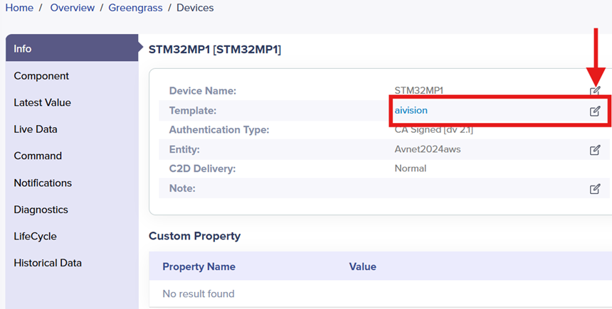

# AI Vision Demo on STM32MP Devices with AWS IoT greengrass nucleus lite

## 1. Overview
In this guide we will deploy an AI Vision Demo greengrass component to an STM32MP device by using Avnet's /IOTCONNECT platform to simplify the process.
The guide is compatible with the following STM32MP series devices:
* STM32MP135F-DK ([Buy Now](https://www.newark.com/stmicroelectronics/stm32mp135f-dk/discovery-kit-32bit-arm-cortex/dp/68AK9977))
* STM32MP157F-DK2 ([Buy Now](https://www.newark.com/stmicroelectronics/stm32mp157f-dk2/discovery-kit-arm-cortex-a7-cortex/dp/14AJ2731))
* STM32MP257F-DK ([Buy Now](https://www.newark.com/stmicroelectronics/stm32mp257f-dk/discovery-board-arm-cortex-a35/dp/21AM3759))
* STM32MP257F-EV1 ([Buy Now](https://www.newark.com/stmicroelectronics/stm32mp257f-ev1/eval-brd-arm-cortex-a35-m33-m0/dp/13AM6530))

## 2. Prerequisites
These instructions assume that you have already completed the QuickStart Guide for one of the devices listed above.  
If not, please complete the QuickStart Guide for your device **to the section on greengrass component deployment** then return to this guide and resume at the next section.
* [STM32MP135F-DK QuickStart](https://github.com/avnet-iotconnect/iotc-python-greengrass-demos/tree/main/stm32mp135f-dk)
* [STM32MP157F-DK2 QuickStart](https://github.com/avnet-iotconnect/iotc-python-greengrass-demos/tree/main/stm32mp157f-dk2)
* [STM32MP257F-DK QuickStart](https://github.com/avnet-iotconnect/iotc-python-greengrass-demos/tree/main/stm32mp257f-dk)
* [STM32MP257F-EV1 QuickStart](https://github.com/avnet-iotconnect/iotc-python-greengrass-demos/tree/main/stm32mp257f-ev1)

> [!IMPORTANT]
> In addition to the hardware and software requirements outlines in the QuickStart guides above, you will also need a **UVC-Compliant USB Camera** such as [this one](https://www.amazon.com/ALPCAM-Distortion-Compliant-Embedded-Industrial/dp/B0B1WTV1KB?th=1) connected to one of the USB type A ports on the board.

## 3. Upload Vision AI Device Template
After successfully following one of the guides listed above you should have the Device Health Monitoring greengrass component deployed and sending basic telemetry to the /IOTCONNECT platform.
This telemetry was defined in the Device Template imported in the QuickStart guide. We need to upload a new device template which defines the telemetry for the Vision AI demo.
1. Download the [Vision AI Device Template](https://github.com/avnet-iotconnect/iotc-python-greengrass-components/blob/07bc25372b13c0c2d12ebaea0c798a61a3e8fd75/st-ai-vision/ai-vision-template.json)
2. Login to the /IOTCONNECT platform
2. Navigate to **Device** and then **Greengrass Device** menu on the left menu
3. Click **Templates** from the bottom menu bar
4. Click the **Create Template** and import the Vision AI Device Template.

## 4. Change to the Vision AI Device Template

1. Navigate to **Device** and then **Greengrass Device** menu on the left menu
2. Click the **edit** button next to the template name and select `aivision` as shown below

## 5. Deploy the Vision AI Greengrass Component
To deploy the Vision AI greengrass component, we'll use /IOTCONNECT to create a deployment package that contains the artifact file and a recipe.
* **Download** and **Extract** the *Vision AI Demo Component*: [iotc-gg-component-st-ai-vision-1.0.3.zip](https://downloads.iotconnect.io/greengrass/components/iotc-gg-component-st-ai-vision-1.0.3.zip)

### Load the Recipe
1. In the /IOTCONNECT platform, click **Package** at the bottom of the screen, then click **Components** at the top.
 
 
2. In the *Create Component* box, browse for the recipe file (`recipe.yaml`) from the previously extracted component archive here:  `<your working directory>\iotc-gg-component-st-ai-vision-1.0.0\st-ai-vision\greengrass-build\recipes\recipe.yaml`

### Load the Artifact 
1. Click the **icon** to the right of "st-ai-vision.zip" and navigate to the st-ai-vision.zip from the previously extracted archive here: `<your working directory>\iotc-gg-component-st-ai-vision-1.0.0\st-ai-vision\greengrass-build\artifacts\io.iotconnect.example.IotConnectStAiVision\1.0.0\st-ai-vision.zip`
2. Click **Save**

### Create Package
1. Verify the component is now list and at the top-right, click **Package**
  
2. Enter a *Name* such as `VisionAIdemo`
3. Select the `aivision` Template
4. Select the **Custom Component** in the drop-down
5. Click **Save**

### Deploy Package
1. Click **Deploy**
  
2. Add a *Name* and select each item in the drop-downs (there will only be one option for each)
3. Ensure you tick the box under "Components" and pick the version `1.0.0`
4. Click **Deploy**

> [!CAUTION]
> This process may take up to 45 minutes - DO NOT restart the board during this time.  
> **Wait until you see "Success" in the _Deployment History_.**

## 6. Import a Dynamic Dashboard
/IOTCONNECT Dynamic Dashboards are an easy way to visualize data and interact with edge devices.  
* Download the *Vision AI Demo* dashboard: [STM32MP-visionAI-dashboard-template.json](./STM32MP-visionAI-dashboard-template.json)
* Switch back to the /IOTCONNECT browser window and verify the device status is displaying as `Connected`
* Click **Create Dashboard** from the top of the page
* Select the **Import Dashboard** option and click **Browse** to select the dashboard template previously downloaded.
* Select the Template ("aivision") and your Device Name
* Enter a name (such as `Vision AI with STM32MP`) and Click **Save** the finalize the import

## 7. Resources
* Try out the universal [Greengrass SDK example components](https://github.com/avnet-iotconnect/iotc-python-greengrass-sdk/tree/main/examples)
* Or other [STM32 Greengrass components](https://github.com/avnet-iotconnect/iotc-python-greengrass-components)
* [More /IOTCONNECT ST Guides](https://avnet-iotconnect.github.io/partners/st/)
* [/IOTCONNECT Overview](https://www.iotconnect.io/)
* [/IOTCONNECT Knowledgebase](https://help.iotconnect.io/)
