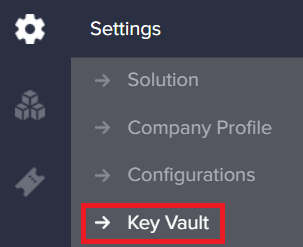
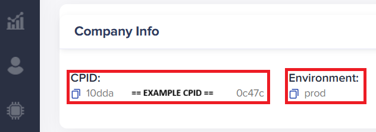

This mini-guide will outline common tasks associated with connecting a device to /IOTCONNECT.

>[!IMPORTANT]
> Before continuing, ensure you have a **Device Template** (.json format) which would have been provided in the guide which linked to this document.

The following topics will be covered:
1. Create /IOTCONNECT Account
2. Import a **Device Template**
3. Create a **Device** and obtain the **Connection Kit**
4. Obtain **CPID** and **Environment**

## 1. Create /IOTCONNECT Account
An /IOTCONNECT account with an AWS backend is required.  If you need to create an account, a free trial subscription is available.
The free subscription may be obtained directly from [iotconnect.io](https://iotconnect.io) or through the AWS Marketplace.

* Option #1 **(Recommended)**   
/IOTCONNECT via [AWS Marketplace](https://github.com/avnet-iotconnect/avnet-iotconnect.github.io/blob/main/documentation/iotconnect/subscription/iotconnect_aws_marketplace.md) - 60 day trial; AWS account creation required  

* Option #2  
/IOTCONNECT via [iotconnect.io](https://subscription.iotconnect.io/subscribe?cloud=aws) - 30 day trial; no credit card required

> [!NOTE]
> Be sure to check any SPAM folder for the temporary password after registering.

Login to the platform by navigating to [console.iotconnect.io](https://console.iotconnect.io)

## 2. Import a Device Template
In this step we will import a pre-made **Device Template**

1. From the navigation panel on the left, select the **Devices** icon and the **Device** sub-menu.   
2. At the bottom of the page, select the **Templates** icon from the toolbar.   
3. At the top-right of the page, select the **Create Template** button.   
4. At the top-right of the page, select the **Import" button**.   
5. Click the **Browse** button, navigate to and select the desired template such as `<template_name>.json`
6. Click **Save**

## 3. Create a Device and Obtain Connection Kit
In this step, we will create a **Device** associated with the previously imported **Device Template**

1. In the ribbon at the bottom of the screen, click the **Devices**
2. At the top-right, click **Create Device**  
 
3. Enter a custom **Unique ID** and **Device Name** such as `MyDevice` (Ensure these match for simplicity)  
4. Select the **Entity** to put the device in (For new accounts, there is only one option)  
5. Select the previously imported **Template**  
6. Unless you already obtained a certificate from the device, select "Auto-generated" under **Device Certificate** .
7. Click **Save & View**
8. Download the "Connection Kit" by clicking the icon in the upper right of the device page.  Save this file as `connectionKit.zip` and then unzip/extract the contents.  

 
## 4. Obtain CPID and Environment
In this step we will locate and copy the **CPID** and **Environment**

1. From the navigation panel on the left, select the **Settings** icon and the **Key Vault** sub-menu. 
2. Copy the **CPID** and **Environment** values and save for future use. 

## 5. Summary
At this point you should have the following information:
* CPID
* Environment
* Certificates from `connectionKit.zip`

**You may now return to any guides which may have brought you to this file.**
