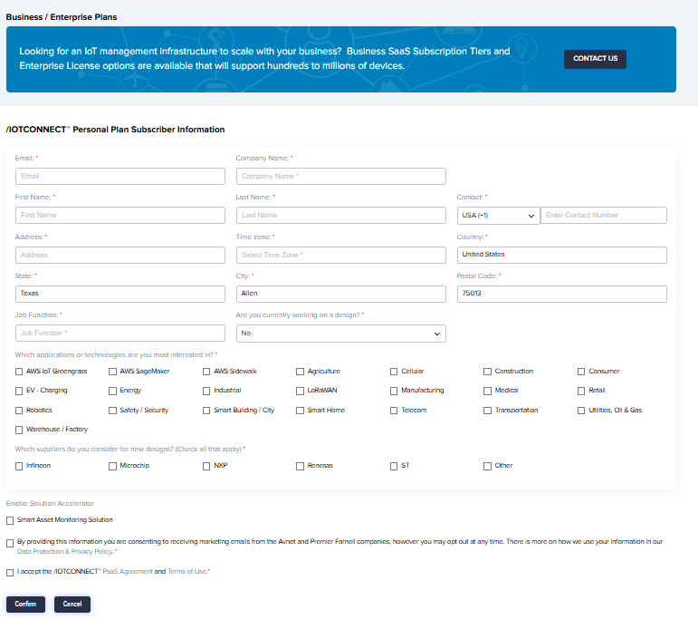

# /IOTCONNECT Subscription from AWS Marketplace
An /IOTCONNECT subscription may be obtained through a variety of different methods.  This page will outline the steps for creating a subscription through the Amazon AWS Marketplace.

For information on creating an /IOTCONNECT account directly on the platform, please see the [subscription.md](subscription.md) document.

## /IOTCONNECT Sign up

Do you have an existing **AWS Marketplace Account**?  
[YES](#yes-i-have-an-aws-marketplace-account) | [NO](#no-i-dont-have-an-aws-marketplace-account)

---
### No, I don't have an AWS Marketplace Account
Navigate to the AWS Marketplace: https://aws.amazon.com/marketplace/
1. Click the link to "Create a new account" at the top-right.
2. Click the button "Create a new AWS account" at the bottom of the page.  

3. Enter your email address and give your AWS account a name  
4. Click "Verify email address" and a verification code will be sent  

5. Follow the 5-step AWS process to finish the setup:
* (1 of 5) Enter the verification code and click "Verify" to begin the setup process
* (2 of 5) Fill out the contact information
* (3 of 5) Enter your billing information
* (4 of 5) Confirm Identify vis SMS or Phone
* (5 of 5) Choose the "Basic support - Free" support plan and click "Complete sign up"
* Continue to the next section of this guide, below.
---
### Yes, I have an AWS Marketplace Account
1. Navigate to the AWS Marketplace: https://aws.amazon.com/marketplace/
2. Click on "Sign in" at the top-right
2. Enter your credentials and log in to the Marketplace
3. Enter "iotconnect" in the search box at the top or use this link: [https://aws.amazon.com/marketplace/search/results?searchTerms=iotconnect](https://aws.amazon.com/marketplace/search/results?searchTerms=iotconnect)
4. Click on the /IOTCONNECT listing in the results  

5. Click the "Try for Free" button on the right  

6. Review the Offer Details and then click the orange "Try for free" button at the bottom-right of the page.  

7. The subscription will begin to process and will take 3 to 5 minutes to complete.  

8. When you see the "Your purchase of /IOTCONNECT is complete" message, follow the link to "Set up your account"  

9. Complete the /IOTCONNECT registration details page and click "REGISTER"  
Optionally, check the box next to "Smart Asset Monitoring Solution" to get started with an example Solution Accelerator.  
More information may be found here [https://www.iotconnect.io/remote-asset-monitoring-solutions.html](https://www.iotconnect.io/remote-asset-monitoring-solutions.html)

11. Expect to receive two emails (check your spam folder if you don't seem both after a short time)
12. Login to the platform using the temporary password and you will be prompted to change it.
13. After changing the password and logging in again, you've successfully completed the setup!
