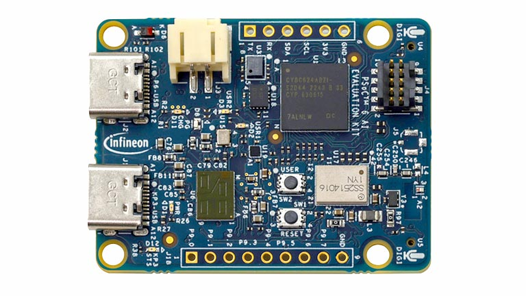
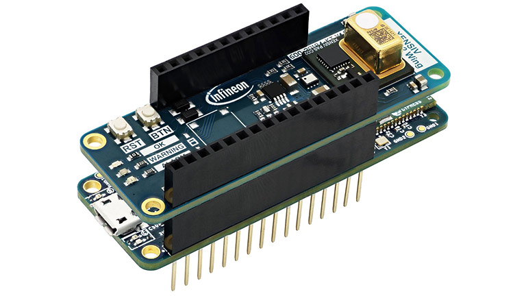
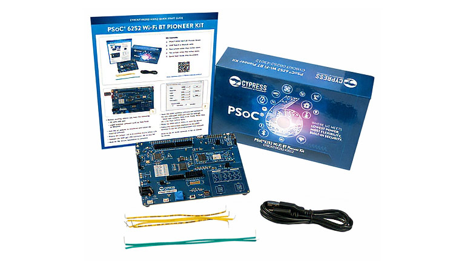
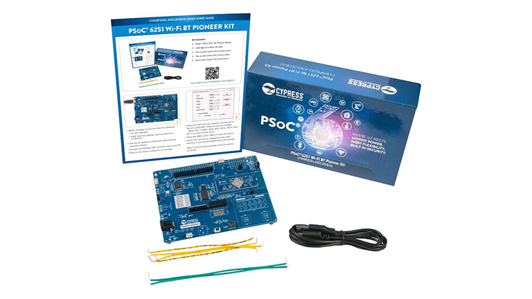
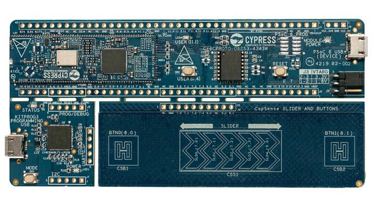

# Infineon

Infineon products that have been pre-enabled to work with /IOTCONNECT.

---

### PSOC™ 6 Artificial Intelligence Evaluation Kit
*Purchase:*  [CY8CKIT-062S2-AI](https://www.avnet.com/shop/us/products/infineon/cy8ckit-062s2-ai-3074457345659496631/)

#### Guides:
* [QuickStart Guide](https://github.com/avnet-iotconnect/avnet-iotc-mtb-ai-baby-monitor/blob/main/QUICKSTART.md)

#### Resources:
* [Webinar: Infineon PSoC 6 AI Evaluation Kit](https://bcove.video/4gLtaP9)
* [Video Demo: PSoC6 AI Sound Classification](https://youtu.be/6mzo-koVk00?si=K7YGhhSrIb4A8PFz)
* [Video Demo: Human Activity Detection](https://bcove.video/40i9psn)
* [More Information](https://www.avnet.com/iotconnect/infineon)

---

### XENSIV™ KIT CSK PASCO2
*Purchase:*  [KITCSKPASCO2TOBO1](https://www.newark.com/infineon/kitcskpasco2tobo1/sensor-kit-co2-sensor/dp/51AK4077)

#### Guides:
* [QuickStart Guide](https://github.com/avnet-iotconnect/avnet-iotc-mtb-xensiv-example/blob/main/QUICKSTART.md)

#### Resources:
* [Webinar: Connect XENSIV to /IOTCONNECT](https://bcove.video/3UmzhQl)
* [More Information](https://www.avnet.com/iotconnect/infineon)

---

### PSOC™ 6 Wi-Fi Bluetooth® pioneer kit
*Purchase:*  [CY8CKIT-062-WIFI-BT](https://www.avnet.com/shop/us/products/infineon/cy8ckit-062-wifi-bt-3074457345644457811)

#### Guides:
* [Developer Guide](https://github.com/avnet-iotconnect/avnet-iotc-mtb-basic-example/blob/main/DEVELOPER_GUIDE.md)

#### Resources:
* [More Information](https://www.avnet.com/iotconnect/infineon)

---

### PSOC™ 6 Wi-Fi Bluetooth® prototyping kit
*Purchase:*  [CY8CPROTO-062-4343W](https://www.avnet.com/shop/us/products/infineon/cy8cproto-062-4343w-3074457345644457812)

#### Guides:
* [Developer Guide](https://github.com/avnet-iotconnect/avnet-iotc-mtb-basic-example/blob/main/DEVELOPER_GUIDE.md)

#### Resources:
* [More Information](https://www.avnet.com/iotconnect/infineon)

---

### PSOC™ 62S1 Wi-Fi Bluetooth® pioneer kit
*Purchase:*  [CYW9P62S1-43438EVB-01](https://www.avnet.com/shop/us/products/infineon/cyw9p62s1-43438evb-01-3074457345644770735) 
*Purchase:*  [CYW9P62S1-43012EVB-01](https://www.newark.com/infineon/cyw9p62s1-43012evb-01/evaluation-kit-bluetooth-wifi/dp/63AK1530)

#### Guides:
* [Developer Guide](https://github.com/avnet-iotconnect/avnet-iotc-mtb-basic-example/blob/main/DEVELOPER_GUIDE.md)

#### Resources:
* [More Information](https://www.avnet.com/iotconnect/infineon)

---

### PSOC™ 62S2 Wi-Fi Bluetooth® pioneer kit
*Purchase:*  [CY8CKIT-062S2-43012](https://www.avnet.com/shop/us/products/infineon/cy8ckit-062s2-43012-3074457345644457809)

#### Guides:
* [Developer Guide](https://github.com/avnet-iotconnect/avnet-iotc-mtb-basic-example/blob/main/DEVELOPER_GUIDE.md)

#### Resources:
* [More Information](https://www.avnet.com/iotconnect/infineon)

---

### PSOC™ 62S3 Wi-Fi Bluetooth® prototyping kit
*Purchase:*  [CY8CPROTO-062S3-4343W](https://www.avnet.com/shop/us/products/infineon/cy8cproto-062s3-4343w-3074457345644457754)

#### Guides:
* [Developer Guide](https://github.com/avnet-iotconnect/avnet-iotc-mtb-basic-example/blob/main/DEVELOPER_GUIDE.md)

#### Resources:
* [More Information](https://www.avnet.com/iotconnect/infineon)
