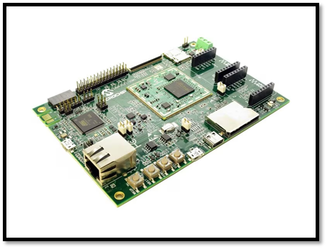
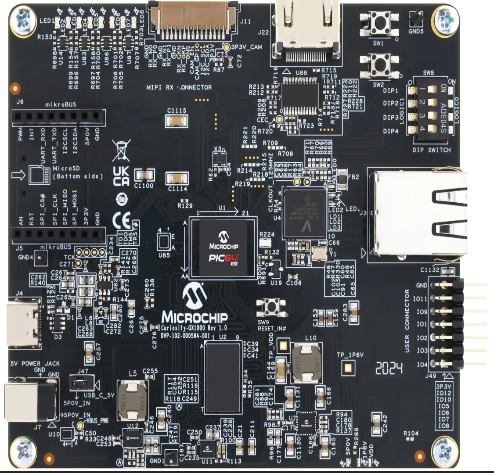
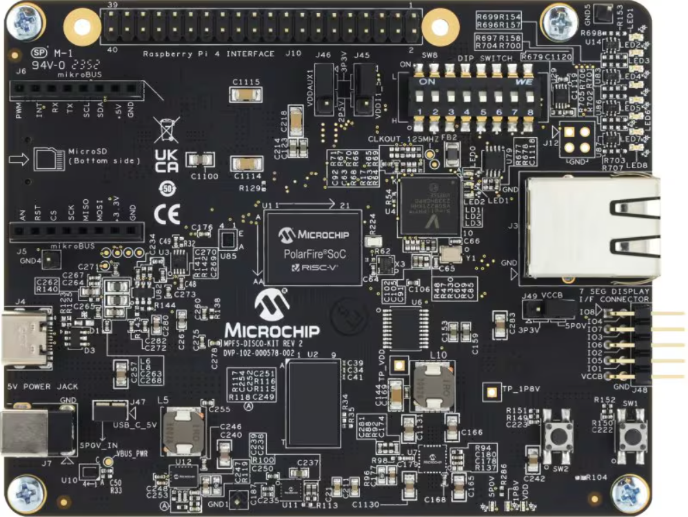
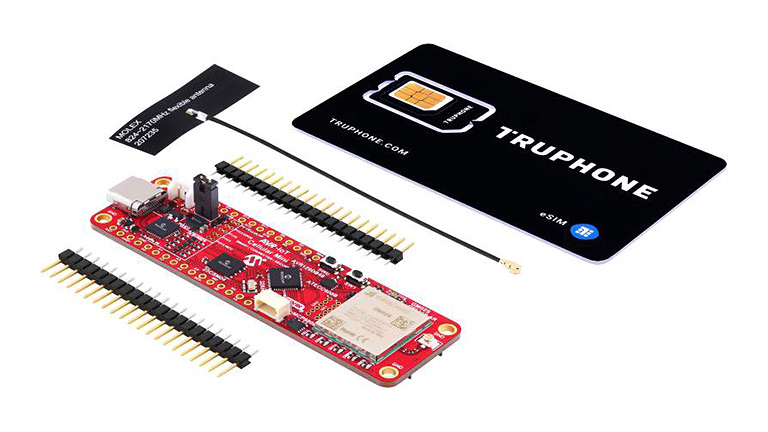

# Microchip

Microchip products that have been pre-enabled to work with /IOTCONNECT.

### SAMA5D27
*Purchase:*  [SAMA5D27](https://www.avnet.com/shop/us/products/microchip/atsama5d27-som1-ek-3074457345633909354/?srsltid=AfmBOorYtSqVK7BDtS-_h4NDc21QKb7yCg1XAcTrRP8ydEuLJZFjeglj) 

#### Guides:
* [QuickStart Guide](https://github.com/avnet-iotconnect/iotc-python-lite-sdk-demos/tree/main/microchip-sama5d27)

#### Resources:
* [More Information](https://www.avnet.com/iotconnect/microchip)

---

### Curiosity PIC64GX1000 Kit
*Purchase:*  [CURIOSITY-PIC64GX1000-KIT](https://www.newark.com/microchip/curiosity-pic64gx1000-kit/curiosity-kit-64bit-risc-v-quad/dp/46AM3917) 

#### Guides:
* [QuickStart Guide](https://github.com/avnet-iotconnect/iotc-python-lite-sdk-demos/tree/main/microchip-pic64gx1000)

#### Resources:
* [More Information](https://www.avnet.com/iotconnect/microchip)

---

### PolarFire SoC Discovery Kit
*Purchase:*  [MPFS-DISCO-KIT](https://export.farnell.com/microchip/mpfs-disco-kit/soc-discovery-kit-64bit-risc-v/dp/4377642) 

#### Guides:
* [QuickStart Guide](https://github.com/avnet-iotconnect/iotc-python-lite-sdk-demos/tree/main/microchip-polarfire-soc-dk)

#### Resources:
* [More Information](https://www.avnet.com/iotconnect/microchip)

---

### WFI32-IoT Development Board
*Purchase:*  [EV36W50A](https://www.avnet.com/shop/us/products/microchip/ev36w50a-3074457345653385127/)

#### Guides:
* [QuickStart Guide](https://github.com/avnet-iotconnect/iotc-azurertos-sdk/tree/main/samples/wfi32iot)

#### Resources:
* [GitHub Repository Folder](https://github.com/avnet-iotconnect/iotc-azurertos-sdk/tree/main/samples/wfi32iot)
* [Webinar: Modernized Condition Monitoring With Next-Generation Sensors](https://event.webcasts.com/starthere.jsp?ei=1689041&tp_key=dc351d6c73)
* [More Information](https://www.avnet.com/iotconnect/microchip)

---

### AVR-IoT Cellular Mini
*Purchase:*  [EV70N78A](https://www.avnet.com/shop/us/products/microchip/ev70n78a-3074457345652818957/)

#### Guides:
* [QuickStart Guide](https://github.com/avnet-iotconnect/iotc-arduino-mchp-avr-sdk)

#### Resources:
* [GitHub Repository Folder](https://github.com/avnet-iotconnect/iotc-arduino-mchp-avr-sdk)
* [Webinar: Developing a Soil Moisture Sensor with the AVR-IoT Cellular Mini Board](https://event.on24.com/wcc/r/4748672/A0619108F2303A3D794F5AFE8D4B9FA2)
* [More Information](https://www.avnet.com/iotconnect/microchip)

---

### 32BIT MPU, ARM CORTEX-A5 Evaluation Kit
*Purchase:*  [ATSAMA5D27-SOM1-EK1](https://www.newark.com/microchip/atsama5d27-som1-ek1/eval-board-32bit-mpu-arm-cortex/dp/44AC2213)

#### Guides:
* [Developer Guide](https://github.com/avnet-iotconnect/meta-iotconnect-docs?tab=readme-ov-file)

#### Resources:
* [More Information](https://www.avnet.com/iotconnect/microchip)

---

### SAM E54 Xplained Pro Evaluation Kit
*Purchase:*  [ATSAME54-XPRO](https://www.avnet.com/shop/us/products/microchip/atsame54-xpro-3074457345632695712)

#### Guides:
* [QuickStart Guide](https://github.com/avnet-iotconnect/iotc-azurertos-sdk/tree/main/samples/same54xpro)

#### Resources:
* [More Information](https://www.avnet.com/iotconnect/microchip)

---

### SAM A7D65 Curiosity Kit
*Purchase:*  [SAMA7D65 Curiosity Kit](https://www.microchipdirect.com/dev-tools/EV63J76A?productLoaded=true&allDevTools=true)

#### Guides:
* [QuickStart Guide](https://github.com/avnet-iotconnect/iotc-python-lite-sdk-demos/tree/main/microchip-sama7d65-curiosity)

#### Resources:
* [More Information](https://www.avnet.com/iotconnect/microchip)
