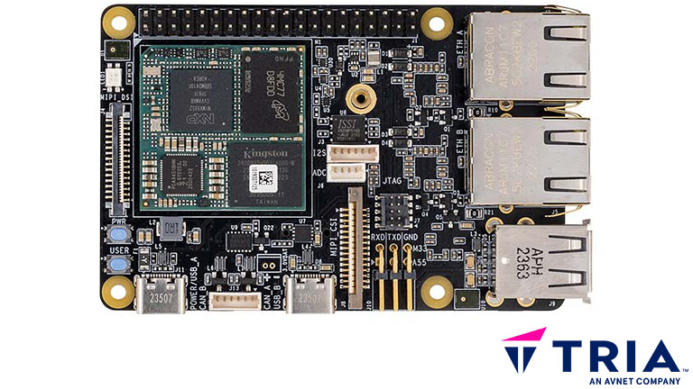

# NXP

NXP products that have been pre-enabled to work with /IOTCONNECT.

### FRDM-IMX93
*Purchase:*  [FRDM-IMX93](https://www.avnet.com/shop/us/products/nxp/frdm-imx93-3074457345660216004)

#### Guides:
* [QuickStart Guide](https://github.com/avnet-iotconnect/iotc-python-lite-sdk-demos/tree/main/nxp-frdm-imx-93)

#### Resources:
* [GitHub Repository Root](https://github.com/avnet-iotconnect/iotc-python-lite-sdk-demos/tree/main/nxp-frdm-imx-93)
* [More Information](https://www.avnet.com/iotconnect/nxp)

---

### MaaXBoard OSM93
*Purchase:*  [AES-MAAXB-OSM93-DK-G](https://www.avnet.com/shop/us/products/avnet-engineering-services/aes-maaxb-osm93-dk-g-3074457345658404668/)

#### Guides:
* [QuickStart Guide](https://github.com/Avnet/MaaXBoard-OSM93-HUB)

#### Resources:
* [GitHub Repository Root](https://github.com/Avnet/MaaXBoard-OSM93-HUB)
* [More Information](https://www.avnet.com/iotconnect/nxp)

---

### MaaxBoard RT
*Purchase:*  [AES-MC-SBC-IMXRT1176-G](https://www.avnet.com/shop/us/products/microchip/ev36w50a-3074457345653385127/)

#### Guides:
* [QuickStart Guide](https://github.com/avnet-iotconnect/iotc-azurertos-sdk/blob/main/samples/maaxboardrt/QUICKSTART.md)

#### Resources:
* [GitHub Repository Root](https://github.com/avnet-iotconnect/iotc-azurertos-sdk/tree/main/samples/maaxboardrt)
* [More Information](https://www.avnet.com/iotconnect/nxp)

---

### MaaXBoard Single Board Computer
*Purchase:*  [AES-MC-SBC-IMX8M-G](https://www.avnet.com/shop/us/products/avnet-engineering-services/aes-mc-sbc-imx8m-g-3074457345642080716)

#### Guides:
* [Compilation Guide](https://github.com/avnet-iotconnect/iotc-yocto-python-sdk/blob/hardknott/board_specific_readmes/maaxboard.md)
* [Demo Guide: Track Voyager](https://github.com/avnet-iotconnect/avnet-iotconnect.github.io/blob/main/documentation/iotc-yocto-c-sdk/voyager-demo/MaaxBoard-IoTC-Voyager-Demo.md)

#### Resources:
* [More Information](https://www.avnet.com/iotconnect/nxp)

---

### MaaxBoard 8ULP
*Purchase:*  [AES-MAAXB-8ULP-SK-G](https://www.avnet.com/shop/us/products/avnet-engineering-services/aes-maaxb-8ulp-sk-g-3074457345648110677)

#### Guides:
* [Compilation Guide](https://github.com/avnet-iotconnect/iotc-yocto-python-sdk/blob/hardknott/board_specific_readmes/maaxboard.md)

#### Resources:
* [More Information](https://www.avnet.com/iotconnect/nxp)

---

### MaaxBoard Mini
*Purchase:*  [AES-MC-SBC-IMX8MINI-G](https://www.avnet.com/shop/us/products/avnet-engineering-services/aes-mc-sbc-imx8mini-g-3074457345643866383)

#### Guides:
* [Compilation Guide](https://github.com/avnet-iotconnect/iotc-yocto-python-sdk/blob/hardknott/board_specific_readmes/maaxboard.md)

#### Resources:
* [Video: Chip to Cloud EV Charging Solution](https://bcove.video/3A04q5f)
* [More Information](https://www.avnet.com/iotconnect/nxp)

---

### i.MX RT1060 Evaluation Kit
*Purchase:*  [MIMXRT1060-EVKB](https://www.avnet.com/shop/us/products/nxp/mimxrt1060-evkb-3074457345653941780/)

#### Guides:

#### Resources:
* [GitHub Repository Folder](https://github.com/avnet-iotconnect/iotc-azurertos-sdk/tree/main/samples/mimxrt1060)
* [More Information](https://www.avnet.com/iotconnect/nxp)

---

### MSC SM2S-IMX8PLUS
*Order Info:*  [SM2S-IMX8PLUS](https://embedded.avnet.com/product/msc-sm2s-imx8plus/#order_info)

#### Guides:
* [Build Information](https://github.com/avnet-iotconnect/iotc-yocto-python-sdk/blob/hardknott/board_specific_readmes/sm2s-imx8mp.md)

#### Resources:
* [More Information](https://embedded.avnet.com/product/msc-sm2s-imx8plus)

---
See Also: [MSC SM2S-MB-EP5](https://embedded.avnet.com/simpleswitch-registration) - SimpleFlex, Application-Ready Embedded Platform SMARC™ 2.1
