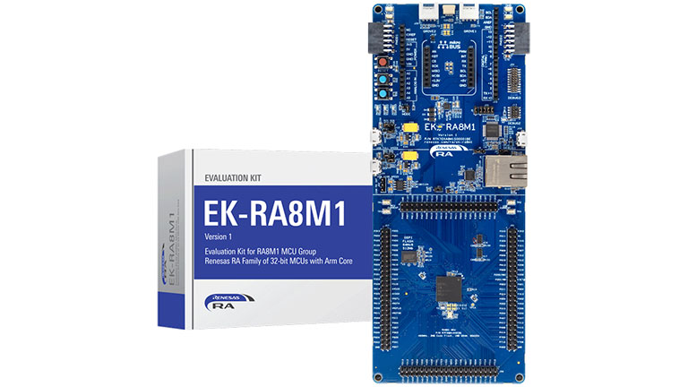
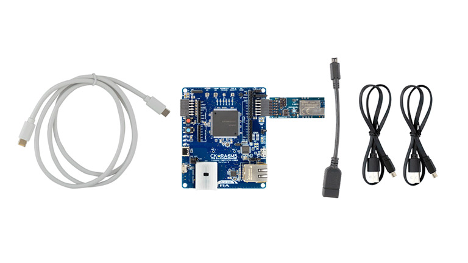
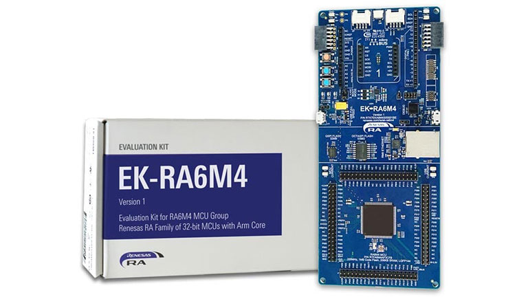
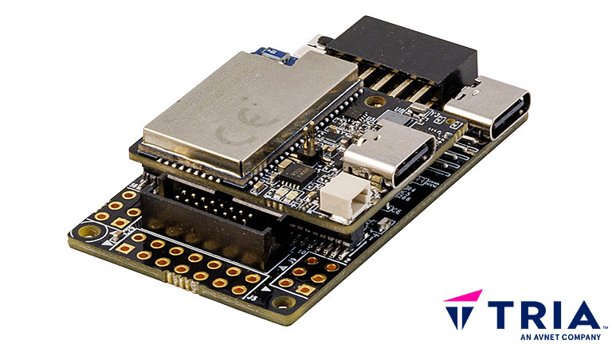
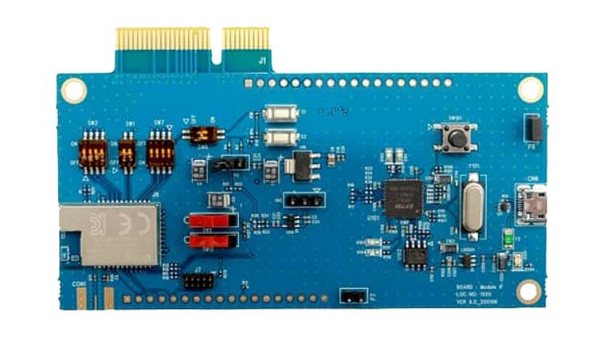
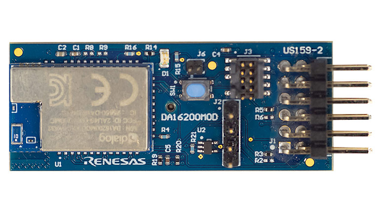
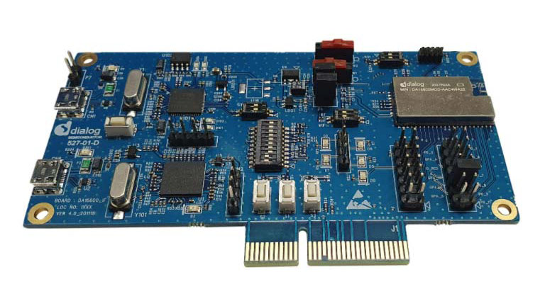
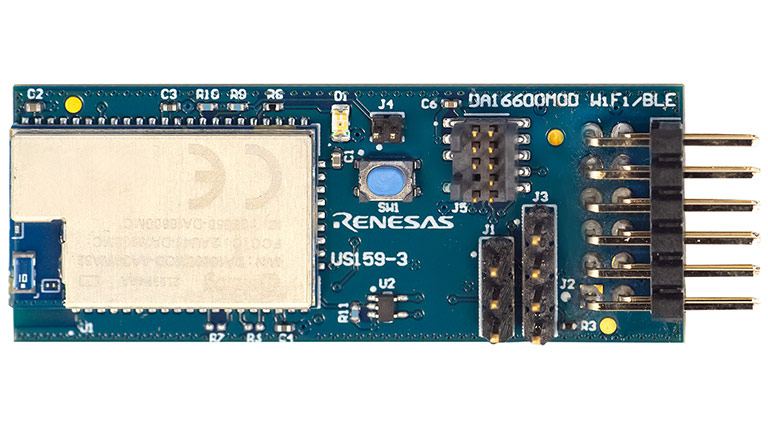
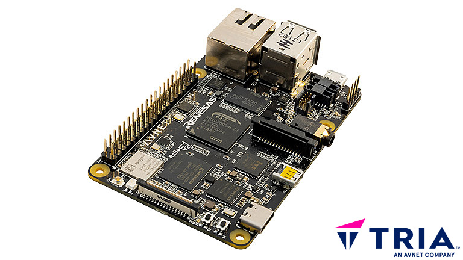
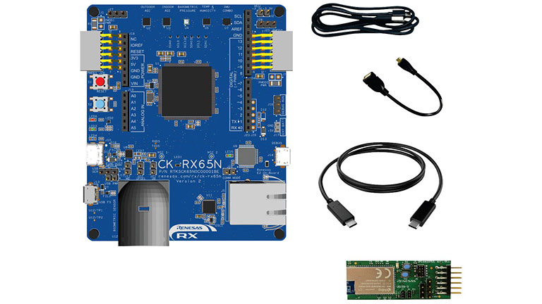

# Renesas

Renesas products that have been pre-enabled to work with /IOTCONNECT.

---

### Evaluation Kit for RA8M1 MCU Group
*Purchase:*  [EK-RA8M1](https://www.avnet.com/shop/us/products/renesas-electronics/rtk7eka8m1s00001be-3074457345653419512)

#### Guides:
* [QuickStart Guide](https://github.com/avnet-iotconnect/iotc-freertos-ek-ra8m1-pmod/blob/main/QUICKSTART.md)

#### Resources:
* [GitHub Repository Root](https://github.com/avnet-iotconnect/iotc-freertos-ek-ra8m1-pmod)
* [More Information](https://www.avnet.com/iotconnect/renesas)

---

### Cloud Kit Based on RA6M5 MCU Group
*Purchase:*  [CK-RA6M5](https://www.avnet.com/shop/us/products/renesas-electronics/rtk7cka6m5s08002be-3074457345653738972)

#### Guides:
* [QuickStart Guide](https://github.com/avnet-iotconnect/iotc-freertos-ck-ra6m5-v2-pmod/blob/master/QUICKSTART.md)

#### Resources:
* [GitHub Repository Root](https://github.com/avnet-iotconnect/iotc-freertos-ck-ra6m5-v2-pmod)
* [More Information](https://www.avnet.com/iotconnect/renesas)

---

### Evaluation Kit for RA6M4 MCU Group
*Purchase:*  [EK-RA6M4](https://www.avnet.com/shop/us/products/renesas-electronics/rtk7eka6m4s00001be-3074457345644043697)

#### Guides:
* [QuickStart Guide](https://github.com/avnet-iotconnect/iotc-freertos-ek-ra6m4-pmod/blob/master/QUICKSTART.md)

#### Resources:
* [GitHub Repository Root](https://github.com/avnet-iotconnect/iotc-freertos-ek-ra6m4-pmod)
* [More Information](https://www.avnet.com/iotconnect/renesas)

---

### RASynBoard NDP120 Evaluation Kit
*Purchase:*  [AES-RASYNB-120](https://www.avnet.com/wps/portal/us/products/avnet-boards/avnet-board-families/rasynboard)

#### Guides:
* [QuickStart Guide](https://github.com/Avnet/RASynBoard-Out-of-Box-Demo/blob/rasynboard_v2_tiny/docs/IoTConnect.md)
* [RASynPuck Demo](https://github.com/Avnet/RASynBoard-Out-of-Box-Demo/blob/rasynboard_v2_tiny/docs/RASynPuckDemo.md)

#### Resources:
* [Webinar: Unlock the Future of Industrial AI with Advanced Acoustic and Vibration Monitoring](https://edgeimpulse.com/events/unlock-the-future-of-industrial-ai-with-advanced-acoustic-and-vibration-monitoring)
* [Video: RASynBoard Pump Demo - Tria](https://players.brightcove.net/4598493563001/BkZJhSKu_default/index.html?videoId=6364919658112)
* [Blog: The RASynPuck Demo, what can you build with the RASynBoard? - Hackster.io](https://www.hackster.io/bwilless/the-rasynpuck-demo-what-can-you-build-with-the-rasynboard-bfd912)
* [Video: Motion Recognition](https://hackster.imgix.net/uploads/attachments/1738627/untitled_project_NiH4p1V6jK.gif?auto=format%2Ccompress&gifq=35&w=900&h=675&fit=min&fm=mp4)
* [More Information](https://www.avnet.com/iotconnect/renesas)

---

### Development Kit, DA16200, Wireless Communication, WiFi with IOT
*Purchase:*  [DA16200MOD-DEVKT](https://onesite-preprod.avnet.com/shop/us/products/renesas-electronics/da16200mod-devkt-3074457345643529171/)

#### Guides:
* [QuickStart Guide](https://github.com/avnet-iotconnect/iotc-dialog-da16k-sdk/tree/main)

#### Resources:
* [More Information](https://www.avnet.com/iotconnect/renesas)

---

### DA16200 Ultra Low Power Wi-Fi Pmod Module Evaluation Board
*Purchase:*  [US159-DA16200MEVZ](https://www.avnet.com/shop/us/products/renesas-electronics/us159-da16200mevz-3074457345649323747)

#### Guides:
* [QuickStart Guide](https://github.com/avnet-iotconnect/iotc-dialog-da16k-sdk/tree/main)

#### Resources:
* [More Information](https://www.avnet.com/iotconnect/renesas)

---

### Development Kit, DA 16200, 2.4GHz Wireless Communication
*Purchase:*  [DA16600MOD-DEVKT](https://www.avnet.com/shop/us/products/renesas-electronics/da16600mod-devkt-3074457345645205670/)

#### Guides:
* [QuickStart Guide](https://github.com/avnet-iotconnect/iotc-dialog-da16k-sdk/tree/main)

#### Resources:
* [More Information](https://www.avnet.com/iotconnect/renesas)

---

### DA16600 Ultra Low Power Wi-Fi and Bluetooth Low Energy Combo Pmod Module Evaluation Board
*Purchase:*  [US159-DA16600EVZ](https://www.avnet.com/shop/us/products/renesas-electronics/da16600mod-devkt-3074457345645205670/)

#### Guides:
* [QuickStart Guide](https://github.com/avnet-iotconnect/iotc-dialog-da16k-sdk/tree/main)

#### Resources:
* [More Information](https://www.avnet.com/iotconnect/renesas)

---

### RZBoard V2L
*Purchase:*  [AES-RZB-V2L-SK-G](https://www.avnet.com/wps/portal/us/products/avnet-boards/avnet-board-families/rzboard-v2l)

#### Guides:
* [Developer Guide](https://github.com/avnet-iotconnect/meta-iotconnect-docs/blob/main/Build/RZBoardV2L/README.md)

#### Resources:
* [Webinar: Unleash the Power of Vision AI: Accelerate Edge AI Solutions with Renesas RZ/V MPUs](https://players.brightcove.net/4598493563001/BkZJhSKu_default/index.html?videoId=6365806777112)
* [Video: EdgeAI Applications featuring Tria Development Boards](https://players.brightcove.net/4598493563001/BkZJhSKu_default/index.html?videoId=6364403224112)
* [Video: VisionAI Use Case with Renesas RZBoard V2L](https://players.brightcove.net/4598493563001/BkZJhSKu_default/index.html?videoId=6364403327112)
* [Video: Smart Parking Demo](https://hackster.imgix.net/uploads/attachments/1721314/spark_iotc_launch.gif?auto=compress&gifq=35&w=740&h=555&fit=max&fm=mp4)
* [Video: RZBuddy](https://youtu.be/mSETqaqMejQEach)
* [Blog: Smart Parking AI with Telemetry on RZBoard V2L - Hackster.io](https://www.hackster.io/lucas-keller/smart-parking-ai-with-telemetry-on-rzboard-v2l-fd3eb9)
* [Blog: Preview - RZbuddy, the Smart Pet Companion for Anxiety - Hackster.io](https://www.hackster.io/lucas-keller/preview-rzbuddy-the-smart-pet-companion-for-anxiety-c50c87)
* [More Information](https://www.avnet.com/iotconnect/renesas)

---

### CK-RX65N Cloud Kit
*Purchase:*  [CK-RK65N](https://www.avnet.com/shop/us/products/renesas-electronics/rtk5ck65n0s08001be-3074457345653738916)

#### Guides:
* [QuickStart Guide](https://github.com/avnet-iotconnect/avnet-iotconnect.github.io/blob/main/documentation/iotc-azurertos-sdk/samples/ck-rx65n/QUICKSTART.md)
* [Developer Guide](https://github.com/avnet-iotconnect/avnet-iotconnect.github.io/blob/main/documentation/iotc-azurertos-sdk/samples/ck-rx65n/DEVELOPER_GUIDE.md)

#### Resources:
* [GitHub Repository Folder](https://github.com/avnet-iotconnect/iotc-azurertos-sdk/tree/main/samples/ck-rx65n)
* [More Information](https://www.avnet.com/iotconnect/renesas)

---
