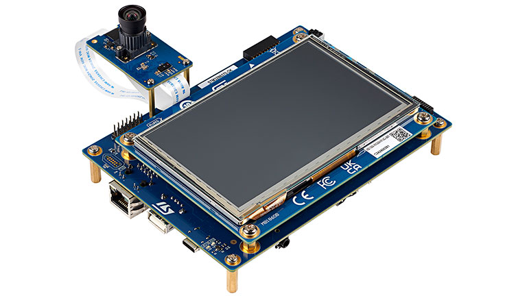
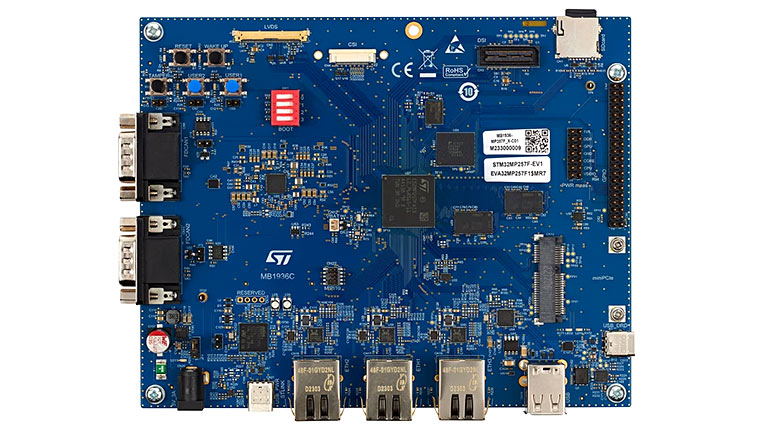
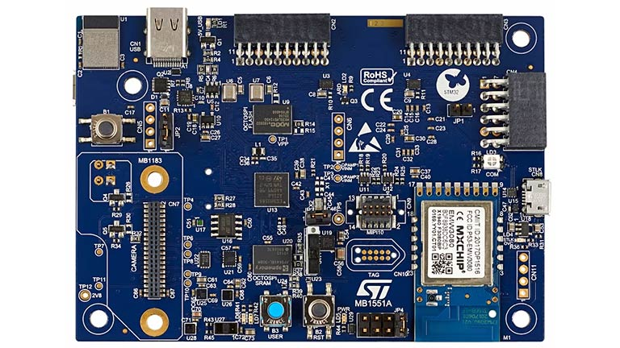
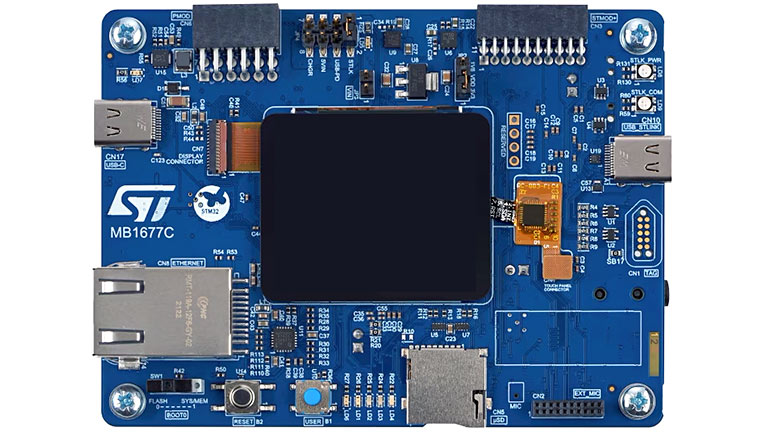
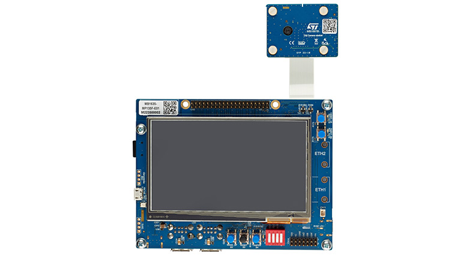
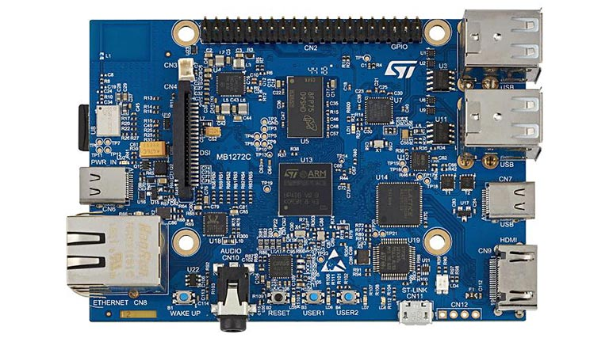
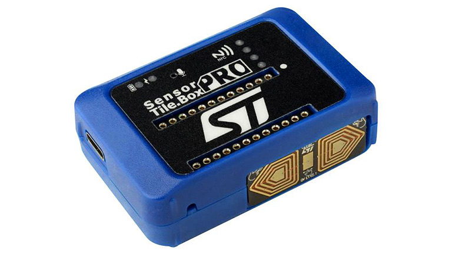
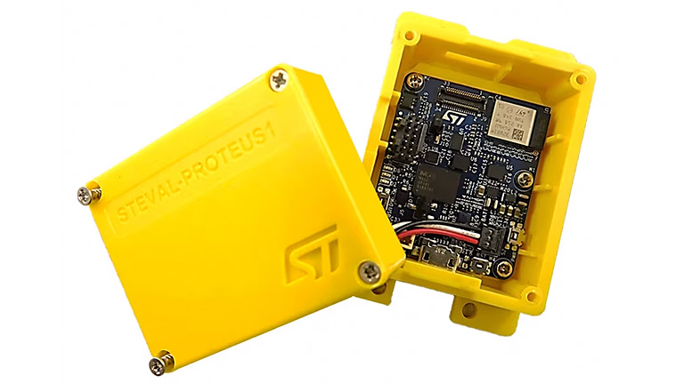
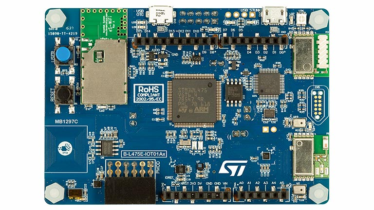

# STMicroelectronics

STMicroelectronics products that have been pre-enabled to work with /IOTCONNECT.

---

### STM32N6 Discovery Kit
*Purchase:*  [STM32N6570-DK](https://www.avnet.com/shop/us/products/stmicroelectronics/stm32n6570-dk-3074457345660283716)

#### Guides:
* [QuickStart Guide](https://github.com/avnet-iotconnect/I-CUBE-IoTC-DA16k-PMOD/blob/main/doc/n6_quickstart.md)

#### Resources:
* [Blog: Unlocking the Power of EdgeAI](https://news.avnet.com/news-blog/news-blog-details/2024/Unlocking-the-Power-of-EdgeAI-Avnet-STMicroelectronics-and-AWS-team-up-to-show-the-power-of-the-STM32N6-MCU/default.aspx)
* [More Information](https://www.avnet.com/iotconnect/st)

---

### STM32MP2 Evaluation Board
*Purchase:*  [STM32MP257F-EV1](https://www.avnet.com/shop/us/products/stmicroelectronics/stm32mp257f-ev1-3074457345659668899/)

#### Guides:
* [QuickStart Guide](https://github.com/avnet-iotconnect/meta-iotconnect-docs/blob/main/QuickStart/STM32MP257.md)
* [QuickStart Guide (Abridged Webinar Version)](https://github.com/avnet-iotconnect/meta-iotconnect-docs/blob/main/QuickStart/ST/STM32MP257/demo-iotc-x-linux-ai/QuickStart_Webinar.md)

#### Resources:
* [Video: Rapidly Create Vision-based Edge AI Solutions with the New STM32MP257](https://players.brightcove.net/4598493563001/BkZJhSKu_default/index.html?videoId=6364751976112)
* [Video: Vision AI Demo](https://players.brightcove.net/4598493563001/BkZJhSKu_default/index.html?videoId=6363657298112)
* [Video: Edge AI](https://players.brightcove.net/4598493563001/BkZJhSKu_default/index.html?videoId=6363655095112)
* [More Information](https://www.avnet.com/iotconnect/st)

---

### STM32MP2 Discovery Kit
*Purchase:* [STM32MP257F-DK](https://www.avnet.com/shop/us/products/stmicroelectronics/stm32mp257f-dk-3074457345659691930/)

#### Guides:
* [QuickStart Guide](https://github.com/avnet-iotconnect/meta-iotconnect-docs/blob/main/QuickStart/STM32MP257.md)

#### Resources:
* [More Information](https://www.avnet.com/iotconnect/st)

---

### STM32U5 Discovery Kit
*Purchase:* [B-U585I-IOT02A](https://www.avnet.com/shop/us/products/stmicroelectronics/b-u585i-iot02a-3074457345647217745)

#### Guides:
 * [QuickStart Guide (AWS)](https://github.com/avnet-iotconnect/iotc-freertos-stm32-u5) - Utilizing IoTConnect on AWS
 * [QuickStart Guide (Azure)](https://github.com/avnet-iotconnect/iotc-azurertos-stm32-u5) - Utilizing IoTConnect on Azure
 * [Demo: Smart City Noise Detection](https://github.com/avnet-iotconnect/iotc-freertos-stm32-u5-ml-demo) - AI/ML Demonstration
 
#### Resources:
* [More Information](https://www.avnet.com/iotconnect/st)

---

### STM32H5 Discovery Kit
*Purchase:* [STM32H573I-DK](https://www.avnet.com/shop/us/products/stmicroelectronics/stm32h573i-dk-3074457345658096192/)

#### Guides:
 * [QuickStart Guide (AWS)](https://github.com/avnet-iotconnect/iotc-freertos-stm32-h5) - Utilizing IoTConnect on AWS
 * [QuickStart Guide (Azure)](https://github.com/avnet-iotconnect/iotc-azurertos-stm32-h5) - Utilizing IoTConnect on Azure

#### Resources:
* [More Information](https://www.avnet.com/iotconnect/st)

---

### STM32MP135 Discovery Kit
*Purchase:* [STM32MP135F-DK]()

#### Guides:
 * [Get Started with Python](https://github.com/avnet-iotconnect/iotc-pov-engineering/tree/main/STM32MP135F-DK2_Demo)
 * [Get Started with Yocto](https://github.com/avnet-iotconnect/iotc-yocto-c-sdk/blob/kirkstone/board_specific_readmes/stm32mpu135.md)
 * [Demo: Vision AI](https://github.com/avnet-iotconnect/meta-iotconnect-docs/tree/main/Build/STM32MP1/mickledore-st-x-linux-ai-demo) - Demonstration of using vision AI with X-Linux

#### Resources:
* [More Information](https://www.avnet.com/iotconnect/st)

---

### STM32MP157 Discovery Kit
*Purchase:* [STM32MP157F-DK2](https://www.newark.com/stmicroelectronics/stm32mp157f-dk2/discovery-kit-arm-cortex-a7-cortex/dp/14AJ2731)

#### Guides:
* [Get Started with Yocto Python](https://github.com/avnet-iotconnect/iotc-yocto-python-sdk/blob/kirkstone/board_specific_readmes/stm32mp157/stm32mp157.md)
* [Get Started with Yocto C](https://github.com/avnet-iotconnect/meta-iotconnect-docs/blob/main/Build/STM32MP157/README.md)
* [Using with ST SensorTile.box PRO](https://github.com/avnet-iotconnect/iotc-python-examples/tree/main/MKBOXPRO_MP157F_Demo) - Bluetooth
* [Using with ST Proteus](https://github.com/avnet-iotconnect/iotc-python-examples/tree/main/PROTEUS_MP157F_Demo) - Bluetooth

#### Resources:
* [More Information](https://www.avnet.com/iotconnect/st)

---

### SensorTile.box PRO
*Purchase:* [STEVAL-MKBOXPRO](https://www.newark.com/stmicroelectronics/steval-mkboxpro/sensortile-box-pro-dev-kit-iot/dp/77AK2834)

#### Guides:
* [Using the IoTConnect App as Gateway](https://github.com/avnet-iotconnect/iotc-gateway-mobile-app)
* [Using the STM32MP157F Discovery Kit as a Gateway](https://github.com/avnet-iotconnect/iotc-python-examples/tree/main/MKBOXPRO_MP157F_Demo)

#### Resources:
* [More Information](https://www.avnet.com/iotconnect/st)

---

### Proteus
*Purchase:* [STEVAL-PROTEUS1](https://www.newark.com/stmicroelectronics/steval-proteus1/evaluation-kit-industrial-sensor/dp/47AK6939)

#### Guides:
* [Using STM32MP157F Discovery Kit as a Gateway](https://github.com/avnet-iotconnect/iotc-python-examples/tree/main/PROTEUS_MP157F_Demo)

#### Resources:
* [More Information](https://www.avnet.com/iotconnect/st)

---

### STM32L4 Discovery Kit
*Purchase:* [B-L475E-IOT01A2](https://www.avnet.com/shop/us/products/stmicroelectronics/b-l475e-iot01a2-3074457345646183681)

#### Guides:
*  [QuickStart Guide (Azure)](https://github.com/avnet-iotconnect/iotc-azurertos-sdk/tree/main/samples/stm32l4) - Utilizing IoTConnect on Azure

#### Resources:
* [More Information](https://www.avnet.com/iotconnect/st)

---

### STM32H7
See the [Portenta H7](https://github.com/avnet-iotconnect/iotc-arduino-pro-portenta-h7-demo) repository for more information.
